# Test Environment

All terminal recordings in the Video Showcase section were captured in a controlled
test environment. This page describes the recording infrastructure, network
architecture, and the rationale behind the design choices.

---

## Infrastructure

Four servers are provisioned in the FRA1 (Frankfurt) datacenter region.
Each server runs a minimal Debian installation with identical specifications.

| Role   | Hostname | OS            |
|--------|----------|---------------|
| Master | master   | Debian 13 x64 |
| Server | server   | Debian 13 x64 |
| Exit   | exit     | Debian 13 x64 |
| Client | client   | Debian 13 x64 |

[](https://www.digitalocean.com/?refcode=d96aacce70d1&utm_campaign=Referral_Invite&utm_medium=Referral_Program&utm_source=badge)

---

## Network Architecture

```mermaid
graph LR
    Director["Director<br/>(Record Server)"]
    Master["Master"]

    subgraph VPC["VPC — 10.10.0.0/24"]
        Server["Server<br/>10.10.0.3"]
        Exit["Exit<br/>10.10.0.4"]
        Client["Client<br/>10.10.0.5"]
    end

    Director -->|"SSH (General)"| Master
    Master -->|"SSH (VPC)"| Server
    Master -->|"SSH (VPC)"| Exit
    Master -->|"SSH (VPC)"| Client
```



The VPC (Virtual Private Cloud) establishes a private `10.10.0.0/24` subnet between
Master and the remaining three servers. The Director machine connects to Master over
the public internet; all subsequent connections traverse the VPC.

| Host   | VPC Address |
|--------|-------------|
| Server | 10.10.0.3   |
| Exit   | 10.10.0.4   |
| Client | 10.10.0.5   |

```
Director --> SSH (Public) --> Master --> SSH (VPC) --> Server | Client | Exit
```

---

## Authenticity and Environment Lifecycle

The recordings in this section fully reflect real-world application scenarios.
All operations were performed on real servers, under real network conditions,
within the test environment described above. No simulations or fabricated
output were used.

After the recording process was completed, the test environment was entirely
destroyed. The environment was provisioned solely for the purpose of capturing
these recordings and was terminated once that purpose was fulfilled.
