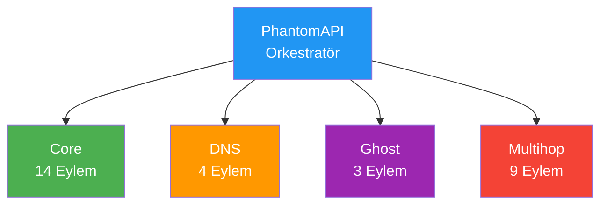
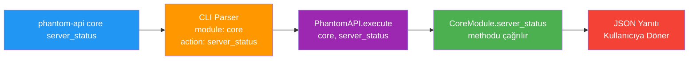

---
extra_javascript:
  - assets/javascripts/asciinema-player.js
  - assets/javascripts/phantom-ascii.js
  - assets/javascripts/animated-ascii-art.js
extra_css:
  - assets/stylesheets/ascii-styles.css
  - assets/stylesheets/animated-ascii-art.css

---

# API

<div class="ascii-demo-container">
  <pre id="phantom-ascii-pulse" class="ascii-art" data-effect="pulse"></pre>
</div>

## Genel Bakış

Phantom-WG, kendi sunucu ortamınızda WireGuard tabanlı VPN altyapısı kurmanıza ve                                                                                                                                                                                             
yönetmenize olanak sağlayan modüler bir araçtır. Temel VPN yönetiminin ötesinde; istemci                                                                                                                                                                                             
yapılandırmalarıyla senkronize DNS yönetimi, wstunnel ile WireGuard trafiğini maskeleyerek                                                                                                                                                                                           
sansüre dayanıklı bağlantı kurma ve trafiği harici WireGuard uç noktaları üzerinden                                                                                                                                                                                                  
yönlendirme gibi gelişmiş özelliklere sahiptir.  

Bu gelişmiş özellikleri dört ana modül aracılığıyla sunar:

- **Core** — Temel VPN yönetimi. İstemci ekleme/kaldırma, yapılandırma dışa aktarma, servis
  kontrolü, güvenlik duvarı denetimi ve ağ ayarlarını kapsar.
- **DNS** — Merkezi DNS yönetimi. Tüm istemciler için DNS sunucu yapılandırmasını yönetir;
  değişiklikler anında tüm istemci profillerine yansır.
- **Ghost** — Sansür direnci. WireGuard trafiğini wstunnel ile HTTPS üzerinden tünelleyerek                                                                                                                                                                                          
  standart web trafiğinden ayırt edilemez hale getirir.   
- **Multihop** — Çok atlamalı yönlendirme. Trafiği harici VPN çıkışları üzerinden
  ileterek kaynak-hedef ilişkisini gizler; tek bir noktanın tüm akışı görmesini engeller.

### Modül Mimarisi

PhantomAPI, tüm modüller arasında merkezi orkestratör görevi görür. Her modül kendi uzmanlık
alanındaki işlemleri (eylemler) bağımsız olarak yürütür; PhantomAPI ise gelen istekleri doğru
modüle yönlendirir ve yanıtları standart formatta döndürür.



Bu yapı sayesinde:
- Her modül bağımsız geliştirilebilir ve test edilebilir
- Yeni modüller sisteme kolayca eklenebilir
- Tüm modüller aynı yanıt formatını kullanır

### API İsteklerinin İşlenmesi

Bir API çağrısı yapıldığında istek şu akışı izler:

1. **Komut Girişi** — Kullanıcı terminalde `phantom-api <modül> <eylem>` komutunu çalıştırır
2. **CLI Ayrıştırma** — CLI aracı komutu analiz ederek modül, eylem ve parametreleri ayırır
3. **API Yönlendirme** — İstek PhantomAPI orkestratörüne iletilir
4. **Modül Çağrısı** — İlgili modülün ilgili metodu çağrılır ve işlem gerçekleştirilir
5. **Yanıt Oluşturma** — Sonuç standart JSON formatında yapılandırılır ve döndürülür



Sisteme iki farklı erişim yöntemiyle ulaşılabilir:

- **CLI** — `phantom-wg` komutuyla başlatılan Rich TUI tabanlı interaktif arayüz.
  Her modül için adım adım yönlendirmeli menüler, renk kodlu durum göstergeleri ve
  sayfalanmış listeler sunar. Teknik bilgiye ihtiyaç duymadan sunucuyu yönetmek isteyen
  kullanıcılar için tasarlanmıştır. Bu dokümantasyondaki CLI önizleme kayıtları ilgili
  işlemlerin interaktif akışını gösterir.

- **API** — `phantom-api` komutuyla erişilen programatik arayüz. Her çağrı standart bir
  JSON yanıtı döndürür; bu sayede betik yazımı, otomasyon, cron görevleri ve harici
  entegrasyonlar kolayca gerçekleştirilebilir.

Her iki yöntem de arka planda aynı modül altyapısını kullanır; CLI'da yapılabilen her işlem
API üzerinden de gerçekleştirilebilir.

---

## Temel Sözdizimi

```bash
phantom-api <modül> <eylem> [anahtar=değer ...]
```

---

## Yanıt Formatı

Tüm API yanıtları tutarlı bir JSON yapısını takip eder. Bu sayede farklı modüllerden
ve eylemlerden gelen yanıtlar aynı mantıkla ayrıştırılabilir:

```json
{
  "success": true,
  "data": {
    "...": "Eyleme özgü yanıt verisi"
  },
  "metadata": {
    "module": "modül_adı",
    "action": "eylem_adı",
    "timestamp": "2025-01-29T12:00:00Z",
    "version": "core-v1"
  }
}
```

Hata yanıtları:

```json
{
  "success": false,
  "error": "Hata mesajı",
  "code": "HATA_KODU",
  "metadata": {
    "module": "modül_adı",
    "action": "eylem_adı",
    "timestamp": "2025-01-29T12:00:00Z",
    "version": "core-v1"
  }
}
```

---

## Core Modülü

Core modülü, Phantom-WG'nin temel yapı taşıdır. WireGuard sunucusunun yaşam döngüsü
(istemci ekleme/kaldırma, yapılandırma dışa aktarma, servis yönetimi, güvenlik duvarı
denetimi, subnet değişikliği ve gelişmiş davranış ayarları) bu modül üzerinden yönetilir.

### İstemci Ekle

<div class="asciinema-player-container">
    <div class="asciinema-player-header">
        <h3>Phantom-WG</h3>
        <span class="asciinema-player-info">CLI Önizleme</span>
    </div>
    <div class="asciinema-player-wrapper">
        <div class="asciinema-player" 
             data-cast-file="recordings/api/add-client"
             data-cols="120"
             data-rows="48"
             data-autoplay="false"
             data-loop="false"
             data-speed="1.5"
             data-theme="solarized-dark"
             data-font-size="small">
        </div>
    </div>
</div>

```bash
phantom-api core add_client client_name="john-laptop"
```

**Parametreler:**
- `client_name` (zorunlu): Alfanümerik, tire ve alt çizgi içerebilir

**Yanıt:**
```json
{
  "success": true,
  "data": {
    "client": {
      "name": "john-laptop",
      "ip": "10.8.0.2",
      "public_key": "SKv9YRp0MgHuMCthVIMBRs4Jfwb+mO3vbfvm9jOrLSY=",
      "created": "2025-09-09T01:14:22.076656",
      "enabled": true
    },
    "message": "Client added successfully"
  },
  "metadata": {
    "module": "core",
    "action": "add_client",
    "timestamp": "2025-09-09T01:14:22.119132Z",
    "version": "core-v1"
  }
}
```

### İstemci Kaldır

<div class="asciinema-player-container">
    <div class="asciinema-player-header">
        <h3>Phantom-WG</h3>
        <span class="asciinema-player-info">CLI Önizleme</span>
    </div>
    <div class="asciinema-player-wrapper">
        <div class="asciinema-player"
             data-cast-file="recordings/api/remove-client"
             data-cols="120"
             data-rows="48"
             data-autoplay="false"
             data-loop="false"
             data-speed="1.5"
             data-theme="solarized-dark"
             data-font-size="small">
        </div>
    </div>
</div>

```bash
phantom-api core remove_client client_name="john-laptop"
```

**Parametreler:**
- `client_name` (zorunlu): Kaldırılacak istemcinin adı


**Yanıt:**
```json
{
  "success": true,
  "data": {
    "removed": true,
    "client_name": "john-laptop",
    "client_ip": "10.8.0.2"
  },
  "metadata": {
    "module": "core",
    "action": "remove_client",
    "timestamp": "2025-09-09T01:16:45.684652Z",
    "version": "core-v1"
  }
}
```

### İstemcileri Listele

<div class="asciinema-player-container">
    <div class="asciinema-player-header">
        <h3>Phantom-WG</h3>
        <span class="asciinema-player-info">CLI Önizleme</span>
    </div>
    <div class="asciinema-player-wrapper">
        <div class="asciinema-player" 
             data-cast-file="recordings/api/list-clients"
             data-cols="120"
             data-rows="48"
             data-autoplay="false"
             data-loop="false"
             data-speed="1.5"
             data-theme="solarized-dark"
             data-font-size="small">
        </div>
    </div>
</div>

```bash
# İlk 10 istemciyi listele
phantom-api core list_clients

# Sayfa başına 20 öğe ile 2. sayfayı listele
phantom-api core list_clients page=2 per_page=20

# İstemcileri ara
phantom-api core list_clients search="john"
```

**Parametreler:**
- `page` (opsiyonel, varsayılan=1): Sayfa numarası
- `per_page` (opsiyonel, varsayılan=10): Sayfa başına öğe sayısı
- `search` (opsiyonel): Arama terimi

**Yanıt:**
```json
{
  "success": true,
  "data": {
    "total": 1,
    "clients": [
      {
        "name": "john-laptop",
        "ip": "10.8.0.2",
        "enabled": true,
        "created": "2025-09-09T01:14:22.076656",
        "connected": false
      }
    ],
    "pagination": {
      "page": 1,
      "per_page": 10,
      "total_pages": 1,
      "has_next": false,
      "has_prev": false,
      "showing_from": 1,
      "showing_to": 1
    }
  },
  "metadata": {
    "module": "core",
    "action": "list_clients",
    "timestamp": "2025-09-09T01:14:32.551562Z",
    "version": "core-v1"
  }
}
```


### İstemci Yapılandırmasını Dışa Aktar

<div class="asciinema-player-container">
    <div class="asciinema-player-header">
        <h3>Phantom-WG</h3>
        <span class="asciinema-player-info">CLI Önizleme</span>
    </div>
    <div class="asciinema-player-wrapper">
        <div class="asciinema-player" 
             data-cast-file="recordings/api/export-client"
             data-cols="120"
             data-rows="48"
             data-autoplay="false"
             data-loop="false"
             data-speed="1.5"
             data-theme="solarized-dark"
             data-font-size="small">
        </div>
    </div>
</div>

```bash
# İstemci yapılandırmasını dışa aktar
phantom-api core export_client client_name="john-laptop"
```

**Parametreler:**
- `client_name` (zorunlu): Dışa aktarılacak istemci

**Yanıt:**
```json
{
  "success": true,
  "data": {
    "client": {
      "name": "john-laptop",
      "ip": "10.8.0.2",
      "created": "2025-09-09T01:14:22.076656",
      "enabled": true,
      "private_key": "INPOjXGUqhzPsS4rE65U7Ao6UXdhXNqwDoQz8HgD53s=",
      "public_key": "SKv9YRp0MgHuMCthVIMBRs4Jfwb+mO3vbfvm9jOrLSY=",
      "preshared_key": "y43/xUvLJBHe7RvsGFoHnURcTzWwrEOcJxx/tT+GQVo="
    },
    "config": "
      [Interface]
      PrivateKey = INPOjXGUqhzPsS4rE65U7Ao6UXdhXNqwDoQz8HgD53s=
      Address = 10.8.0.2/24
      DNS = 8.8.8.8, 8.8.4.4
      MTU = 1420

      [Peer]
      PublicKey = Y/V6vf2w+AWpqz3h6DYAOHuW3ZJ3vZ0jSc8D0edVthw=
      PresharedKey = y43/xUvLJBHe7RvsGFoHnURcTzWwrEOcJxx/tT+GQVo=
      Endpoint = 157.230.114.231:51820
      AllowedIPs = 0.0.0.0/0, 10.8.0.0/24
      PersistentKeepalive = 25
    "
  },
  "metadata": {
    "module": "core",
    "action": "export_client",
    "timestamp": "2025-09-09T01:14:43.740027Z",
    "version": "core-v1"
  }
}
```

**Not:** Yapılandırma, veritabanından ve mevcut DNS ayarlarından dinamik olarak üretilir. QR kod
oluşturma CLI arayüzünde mevcuttur.

### Sunucu Durumu

<div class="asciinema-player-container">
    <div class="asciinema-player-header">
        <h3>Phantom-WG</h3>
        <span class="asciinema-player-info">CLI Önizleme</span>
    </div>
    <div class="asciinema-player-wrapper">
        <div class="asciinema-player" 
             data-cast-file="recordings/api/server-status"
             data-cols="120"
             data-rows="48"
             data-autoplay="false"
             data-loop="false"
             data-speed="1.5"
             data-theme="solarized-dark"
             data-font-size="small">
        </div>
    </div>
</div>

```bash
phantom-api core server_status
```

**Yanıt:**
```json
{
  "success": true,
  "data": {
    "service": {
      "running": true,
      "service_name": "wg-quick@wg_main",
      "started_at": "Tue 2025-09-09 01:11:47 UTC",
      "pid": "0"
    },
    "interface": {
      "active": true,
      "interface": "wg_main",
      "peers": [
        {
          "public_key": "SKv9YRp0MgHuMCthVIMBRs4Jfwb+mO3vbfvm9jOrLSY=",
          "preshared_key": "(hidden)",
          "allowed_ips": "10.8.0.2/32"
        }
      ],
      "public_key": "Y/V6vf2w+AWpqz3h6DYAOHuW3ZJ3vZ0jSc8D0edVthw=",
      "port": 51820,
      "rx_bytes": 0,
      "tx_bytes": 0
    },
    "configuration": {
      "interface": "wg_main",
      "config_file": "/etc/wireguard/wg_main.conf",
      "port": 51820,
      "network": "10.8.0.0/24",
      "dns": [
        "8.8.8.8",
        "8.8.4.4"
      ],
      "config_exists": true
    },
    "clients": {
      "total_configured": 1,
      "enabled_clients": 1,
      "disabled_clients": 0,
      "active_connections": 0
    },
    "system": {
      "install_dir": "/opt/phantom-wg",
      "config_dir": "/opt/phantom-wg/config",
      "data_dir": "/opt/phantom-wg/data",
      "firewall": {
        "status": "active"
      },
      "wireguard_module": true
    }
  },
  "metadata": {
    "module": "core",
    "action": "server_status",
    "timestamp": "2025-09-09T01:15:03.512070Z",
    "version": "core-v1"
  }
}
```

### Servis Günlükleri

<div class="asciinema-player-container">
    <div class="asciinema-player-header">
        <h3>Phantom-WG</h3>
        <span class="asciinema-player-info">CLI Önizleme</span>
    </div>
    <div class="asciinema-player-wrapper">
        <div class="asciinema-player" 
             data-cast-file="recordings/api/service-logs"
             data-cols="120"
             data-rows="48"
             data-autoplay="false"
             data-loop="false"
             data-speed="1.5"
             data-theme="solarized-dark"
             data-font-size="small">
        </div>
    </div>
</div>

```bash
# Son 50 satırı al (varsayılan)
phantom-api core service_logs

# Son 100 satırı al
phantom-api core service_logs lines=100
```

**Parametreler:**
- `lines` (opsiyonel, varsayılan=50): Günlük satır sayısı

### En Son Eklenen İstemciler

<div class="asciinema-player-container">
    <div class="asciinema-player-header">
        <h3>Phantom-WG</h3>
        <span class="asciinema-player-info">CLI Önizleme</span>
    </div>
    <div class="asciinema-player-wrapper">
        <div class="asciinema-player" 
             data-cast-file="recordings/api/recent-clients"
             data-cols="120"
             data-rows="48"
             data-autoplay="false"
             data-loop="false"
             data-speed="1.5"
             data-theme="solarized-dark"
             data-font-size="small">
        </div>
    </div>
</div>

```bash
# Son 5 istemciyi al (varsayılan)
phantom-api core latest_clients

# Son 10 istemciyi al
phantom-api core latest_clients count=10
```

**Parametreler:**
- `count` (opsiyonel, varsayılan=5): İstemci sayısı

### Servisi Yeniden Başlat

**Dikkat:** Yeniden başlatma sırasında bağlı tüm istemcilerin bağlantısı geçici olarak kesilir.

<div class="asciinema-player-container">
    <div class="asciinema-player-header">
        <h3>Phantom-WG</h3>
        <span class="asciinema-player-info">CLI Önizleme</span>
    </div>
    <div class="asciinema-player-wrapper">
        <div class="asciinema-player" 
             data-cast-file="recordings/api/restart-service"
             data-cols="120"
             data-rows="48"
             data-autoplay="false"
             data-loop="false"
             data-speed="1.5"
             data-theme="solarized-dark"
             data-font-size="small">
        </div>
    </div>
</div>

```bash
phantom-api core restart_service
```

**Yanıt:**
```json
{
  "success": true,
  "data": {
    "restarted": true,
    "service_active": true,
    "interface_up": true,
    "message": "Service restarted successfully"
  }
}
```

### Güvenlik Duvarı Durumu

<div class="asciinema-player-container">
    <div class="asciinema-player-header">
        <h3>Phantom-WG</h3>
        <span class="asciinema-player-info">CLI Önizleme</span>
    </div>
    <div class="asciinema-player-wrapper">
        <div class="asciinema-player" 
             data-cast-file="recordings/api/firewall-status"
             data-cols="120"
             data-rows="48"
             data-autoplay="false"
             data-loop="false"
             data-speed="1.5"
             data-theme="solarized-dark"
             data-font-size="small">
        </div>
    </div>
</div>

```bash
phantom-api core get_firewall_status
```

**Yanıt:**
```json
{
  "success": true,
  "data": {
    "ufw": {
      "enabled": true,
      "rules": [
        "51820/udp                  ALLOW IN    Anywhere",
        "51820/udp (v6)             ALLOW IN    Anywhere (v6)"
      ]
    },
    "iptables": {
      "has_rules": true,
      "nat_rules": [],
      "filter_rules": []
    },
    "nat": {
      "enabled": true,
      "rules": [
        "MASQUERADE  0    --  10.8.0.0/24          0.0.0.0/0"
      ]
    },
    "ports": {
      "wireguard_port": 51820,
      "listening": true
    },
    "status": "active"
  },
  "metadata": {
    "module": "core",
    "action": "get_firewall_status",
    "timestamp": "2025-07-11T05:15:59.611420Z",
    "version": "core-v1"
  }
}
```

### Tweak Ayarları

<div class="asciinema-player-container">
    <div class="asciinema-player-header">
        <h3>Phantom-WG</h3>
        <span class="asciinema-player-info">CLI Önizleme</span>
    </div>
    <div class="asciinema-player-wrapper">
        <div class="asciinema-player" 
             data-cast-file="recordings/api/tweak-settings"
             data-cols="120"
             data-rows="48"
             data-autoplay="false"
             data-loop="false"
             data-speed="1.5"
             data-theme="solarized-dark"
             data-font-size="small">
        </div>
    </div>
</div>

```bash
# Tüm tweak ayarlarını al
phantom-api core get_tweak_settings

# Belirli bir ayarı güncelle
phantom-api core update_tweak_setting setting_name="restart_service_after_client_creation" value=false
```

**update_tweak_setting için parametreler:**
- `setting_name` (zorunlu): Güncellenecek ayarın adı
- `value` (zorunlu): Yeni değer (string olarak boolean: "true"/"false")

**Mevcut Ayarlar:**
- `restart_service_after_client_creation`: İstemci eklerken WireGuard servisini yeniden başlatır mı
  (varsayılan: false)
  - `false` olduğunda: İstemcileri dinamik olarak eklemek için `wg set` komutunu kullanır
    (servis yeniden başlatılmaz)
  - `true` olduğunda: Tüm WireGuard servisini yeniden başlatır (tüm istemciler için geçici bağlantı
    kesilmesine neden olur)

**get_tweak_settings için yanıt:**
```json
{
  "success": true,
  "data": {
    "restart_service_after_client_creation": false,
    "restart_service_after_client_creation_description": "Restart WireGuard service after adding & removing clients (causes connection drops)"
  }
}
```

### Varsayılan Subnet'i Değiştir

<div class="asciinema-player-container">
    <div class="asciinema-player-header">
        <h3>Phantom-WG</h3>
        <span class="asciinema-player-info">CLI Önizleme</span>
    </div>
    <div class="asciinema-player-wrapper">
        <div class="asciinema-player" 
             data-cast-file="recordings/api/change-subnet"
             data-cols="120"
             data-rows="48"
             data-autoplay="false"
             data-loop="false"
             data-speed="1.5"
             data-theme="solarized-dark"
             data-font-size="small">
        </div>
    </div>
</div>

```bash
# Mevcut subnet bilgisini al
phantom-api core get_subnet_info

# Yeni bir subnet'i doğrula
phantom-api core validate_subnet_change new_subnet="192.168.100.0/24"

# Subnet'i değiştir (onay gerekir)
phantom-api core change_subnet new_subnet="192.168.100.0/24" confirm=true
```


**get_subnet_info için yanıt:**
```json
{
  "success": true,
  "data": {
    "current_subnet": "10.8.0.0/24",
    "subnet_size": 254,
    "usable_ips": 254,
    "network_address": "10.8.0.0",
    "broadcast_address": "10.8.0.255",
    "netmask": "255.255.255.0",
    "prefixlen": 24,
    "clients": {
      "total": 1,
      "active": 0,
      "ip_usage_percentage": 0.39
    },
    "server_ip": "10.8.0.1",
    "first_client_ip": "10.8.0.2",
    "last_client_ip": "10.8.0.254",
    "can_change": true,
    "blockers": {
      "ghost_mode": false,
      "multihop": false,
      "active_connections": false
    },
    "main_interface": {
      "interface": "eth0",
      "ip": "165.227.146.222",
      "network": "165.227.146.222/20"
    },
    "warnings": [
      "WireGuard service will be restarted",
      "Firewall rules will be updated",
      "Brief connectivity interruption expected"
    ]
  },
  "metadata": {
    "module": "core",
    "action": "get_subnet_info",
    "timestamp": "2025-07-11T05:17:09.346288Z",
    "version": "core-v1"
  }
}
```

**validate_subnet_change için yanıt:**
```json
{
  "success": true,
  "data": {
    "valid": true,
    "new_subnet": "192.168.100.0/24",
    "current_subnet": "10.8.0.0/24",
    "checks": {
      "subnet_size": {
        "valid": true,
        "usable_ips": 254,
        "prefixlen": 24
      },
      "private_subnet": {
        "valid": true,
        "private_range": "192.168.0.0/16"
      },
      "network_conflicts": {
        "valid": true,
        "conflicts": []
      },
      "capacity": {
        "valid": true,
        "usable_ips": 254,
        "required_ips": 2,
        "utilization_after": 0.39
      }
    },
    "warnings": [],
    "errors": [],
    "ip_mapping_preview": {
      "total_mappings": 2,
      "mappings": {
        "server": {
          "old": "10.8.0.1",
          "new": "192.168.100.1"
        },
        "test-api-demo": {
          "old": "10.8.0.2",
          "new": "192.168.100.2"
        }
      }
    }
  },
  "metadata": {
    "module": "core",
    "action": "validate_subnet_change",
    "timestamp": "2025-07-11T05:17:17.124283Z",
    "version": "core-v1"
  }
}
```

**change_subnet için yanıt:**
```json
{
  "success": true,
  "data": {
    "success": true,
    "old_subnet": "10.8.0.0/24",
    "new_subnet": "192.168.100.0/24",
    "clients_updated": 5,
    "backup_id": "subnet_change_1738257600",
    "ip_mapping": {
      "10.8.0.1": "192.168.100.1",
      "10.8.0.2": "192.168.100.2",
      "10.8.0.3": "192.168.100.3"
    },
    "message": "Successfully changed subnet from 10.8.0.0/24 to 192.168.100.0/24"
  }
}
```

**Önemli Notlar:**
- Ghost Mode veya Multihop aktifken subnet değişikliği engellenir
- Değişiklik sırasında tüm istemcilerin bağlantısı kesilir
- İstemci yapılandırmaları otomatik olarak güncellenir
- Güvenlik duvarı kuralları (iptables ve UFW) otomatik olarak güncellenir
- Değişikliklerden önce tam yedekleme oluşturulur
- Hata durumunda otomatik geri alma yapılır

---

## DNS Modülü

<div class="asciinema-player-container">
    <div class="asciinema-player-header">
        <h3>Phantom-WG</h3>
        <span class="asciinema-player-info">CLI Önizleme</span>
    </div>
    <div class="asciinema-player-wrapper">
        <div class="asciinema-player" 
             data-cast-file="recordings/api/dns-compact"
             data-cols="120"
             data-rows="48"
             data-autoplay="false"
             data-loop="false"
             data-speed="1.5"
             data-theme="solarized-dark"
             data-font-size="small">
        </div>
    </div>
</div>

### DNS Sunucularını Değiştir

Tüm istemcilerin kullanacağı birincil ve/veya ikincil DNS sunucularını günceller.
Değişiklik anında tüm istemci yapılandırmalarına yansır.

```bash
# Her iki DNS sunucusunu değiştir
phantom-api dns change_dns_servers primary="1.1.1.1" secondary="1.0.0.1"

# Sadece birincil DNS'i değiştir
phantom-api dns change_dns_servers primary="8.8.8.8"
```

**Parametreler:**
- `primary` (opsiyonel): Birincil DNS sunucu IP'si
- `secondary` (opsiyonel): İkincil DNS sunucu IP'si


**Yanıt:**
```json
{
  "success": true,
  "data": {
    "success": true,
    "dns_servers": {
      "primary": "1.1.1.1",
      "secondary": "1.0.0.1",
      "previous_primary": "8.8.8.8",
      "previous_secondary": "1.1.1.1"
    },
    "client_configs_updated": {
      "success": true,
      "message": "DNS configuration updated globally"
    }
  },
  "metadata": {
    "module": "dns",
    "action": "change_dns_servers",
    "timestamp": "2025-07-11T05:17:32.309051Z",
    "version": "core-v1"
  }
}
```

### DNS Sunucularını Test Et

```bash
# Yapılandırılmış sunucuları test et
phantom-api dns test_dns_servers

# Belirli sunucuları test et
phantom-api dns test_dns_servers servers='["8.8.8.8","1.1.1.1"]'

# Belirli bir alan adı ile test et
phantom-api dns test_dns_servers domain="example.com"
```

**Parametreler:**
- `servers` (opsiyonel): DNS sunucularının JSON dizisi
- `domain` (opsiyonel, varsayılan="google.com"): Test alan adı

**Yanıt:**
```json
{
  "success": true,
  "data": {
    "all_passed": true,
    "servers_tested": 2,
    "results": [
      {
        "server": "1.1.1.1",
        "success": true,
        "status": "OK",
        "response_time_ms": null,
        "test_domain": "google.com"
      },
      {
        "server": "1.0.0.1",
        "success": true,
        "status": "OK",
        "response_time_ms": null,
        "test_domain": "google.com"
      }
    ]
  },
  "metadata": {
    "module": "dns",
    "action": "test_dns_servers",
    "timestamp": "2025-07-11T05:17:44.423898Z",
    "version": "core-v1"
  }
}
```

### DNS Durumu

```bash
phantom-api dns status
```

**Yanıt:**
```json
{
  "success": true,
  "data": {
    "mode": "standard",
    "configuration": {
      "primary": "1.1.1.1",
      "secondary": "1.0.0.1"
    },
    "health": {
      "status": "healthy",
      "test_results": [
        {
          "server": "1.1.1.1",
          "tests": [
            {
              "domain": "google.com",
              "success": "142.250.184.206",
              "response": "142.250.184.206",
              "error": null
            },
            {
              "domain": "cloudflare.com",
              "success": "104.16.133.229",
              "response": "104.16.133.229",
              "error": null
            }
          ]
        },
        {
          "server": "1.0.0.1",
          "tests": [
            {
              "domain": "google.com",
              "success": "142.250.184.206",
              "response": "142.250.184.206",
              "error": null
            },
            {
              "domain": "cloudflare.com",
              "success": "104.16.132.229",
              "response": "104.16.132.229",
              "error": null
            }
          ]
        }
      ]
    }
  },
  "metadata": {
    "module": "dns",
    "action": "status",
    "timestamp": "2025-07-11T05:17:52.286147Z",
    "version": "core-v1"
  }
}
```

### DNS Sunucularını Al

```bash
phantom-api dns get_dns_servers
```

**Yanıt:**
```json
{
  "success": true,
  "data": {
    "primary": "8.8.8.8",
    "secondary": "1.1.1.1"
  },
  "metadata": {
    "module": "dns",
    "action": "get_dns_servers",
    "timestamp": "2025-07-11T05:17:24.846383Z",
    "version": "core-v1"
  }
}
```

---

## Ghost Modülü

<div class="asciinema-player-container">
    <div class="asciinema-player-header">
        <h3>Phantom-WG</h3>
        <span class="asciinema-player-info">CLI Önizleme</span>
    </div>
    <div class="asciinema-player-wrapper">
        <div class="asciinema-player" 
             data-cast-file="recordings/api/ghost-compact"
             data-cols="120"
             data-rows="48"
             data-autoplay="false"
             data-loop="false"
             data-speed="1.5"
             data-theme="solarized-dark"
             data-font-size="small">
        </div>
    </div>
</div>

### Ghost Mode'u Etkinleştir

```bash
# Özel alan adı ile etkinleştir
phantom-api ghost enable domain="cdn.example.com"

# sslip.io ile etkinleştir (otomatik wildcard SSL)
phantom-api ghost enable domain="157-230-114-231.sslip.io"
```

**Parametreler:**
- `domain` (zorunlu): Sunucuya işaret eden A kaydı olan alan adı (sslip.io/nip.io destekler)

**Yanıt:**
```json
{
  "success": true,
  "data": {
    "status": "active",
    "server_ip": "157.230.114.231",
    "domain": "157-230-114-231.sslip.io",
    "secret": "Ui1RVMCxicaByr7C5XrgqS5yCilLmkCAXMcF8oZP4ZcVkQAvZhRCht3hsHeJENac",
    "protocol": "wss",
    "port": 443,
    "activated_at": "2025-09-09T01:41:24.079841",
    "connection_command": "wstunnel client --http-upgrade-path-prefix \"Ui1RVMCxicaByr7C5XrgqS5yCilLmkCAXMcF8oZP4ZcVkQAvZhRCht3hsHeJENac\" -L udp://127.0.0.1:51820:127.0.0.1:51820 wss://157-230-114-231.sslip.io:443"
  },
  "metadata": {
    "module": "ghost",
    "action": "enable",
    "timestamp": "2025-09-09T01:41:32.236798Z",
    "version": "core-v1"
  }
}
```

**Notlar:**
- `secret` güvenli WebSocket tünelleme için oluşturulan benzersiz bir token'dır
- `connection_command` istemcilerin çalıştırması gereken tam wstunnel komutunu gösterir

### Ghost Mode'u Devre Dışı Bırak

```bash
phantom-api ghost disable
```

**Yanıt:**
```json
{
  "success": true,
  "data": {
    "status": "inactive",
    "message": "Ghost Mode disabled successfully",
    "restored": true
  },
  "metadata": {
    "module": "ghost",
    "action": "disable",
    "timestamp": "2025-09-09T01:43:07.217952Z",
    "version": "core-v1"
  }
}
```

**Notlar:**
- Port 51820'de doğrudan WireGuard bağlantısını geri yükler
- Tüm istemciler otomatik olarak normal WireGuard yapılandırmasına döner

### Ghost Mode Durumu

```bash
phantom-api ghost status
```

**Yanıt (Pasif):**
```json
{
  "success": true,
  "data": {
    "status": "inactive",
    "enabled": false,
    "message": "Ghost Mode is not active"
  },
  "metadata": {
    "module": "ghost",
    "action": "status",
    "timestamp": "2025-09-09T01:16:11.292837Z",
    "version": "core-v1"
  }
}
```

**Casper Aracı ile İstemci Yapılandırması Dışa Aktarma:**

Ghost Mode aktifken istemcilerin bağlantı kurabilmesi için hem wstunnel istemcisini
çalıştırmaları hem de özel bir WireGuard yapılandırması kullanmaları gerekir. `phantom-casper`
aracı bu iki bileşeni bir arada, adım adım talimatlarla sunan bağımsız bir yardımcı araçtır:

```bash
# Ghost Mode için istemci yapılandırmasını dışa aktar
phantom-casper [kullanıcıadı]

# Gerçek bir istemci ile örnek
phantom-casper demo-casper
```

**Örnek Çıktı:**
```
================================================================================
PHANTOM-WG - GHOST MODE İSTEMCİ YAPILANDIRMASI
================================================================================

İstemci: demo-casper
Sunucu: 157-230-114-231.sslip.io
Oluşturulma: 2025-09-09 01:41:50

--------------------------------------------------------------------------------
ADIM 1: wstunnel istemcisini başlat
--------------------------------------------------------------------------------

Bu komutu ayrı bir terminalde çalıştırın (çalışır durumda tutun):

    wstunnel client --http-upgrade-path-prefix "Ui1RVMCxicaByr7C5XrgqS5yCilLmkCAXMcF8oZP4ZcVkQAvZhRCht3hsHeJENac" \
        -L udp://127.0.0.1:51820:127.0.0.1:51820 wss://157-230-114-231.sslip.io:443

--------------------------------------------------------------------------------
ADIM 2: WireGuard Yapılandırması
--------------------------------------------------------------------------------

Aşağıdaki yapılandırmayı bir dosyaya kaydedin (örn: phantom-ghost.conf):

[Interface]
PrivateKey = SI5AXDC9e5ERFwUKBr391MAwSeHIebG4l7R+N7xssVg=
Address = 10.8.0.2/24
DNS = 8.8.8.8, 8.8.4.4
MTU = 1420

[Peer]
PublicKey = Y/V6vf2w+AWpqz3h6DYAOHuW3ZJ3vZ0jSc8D0edVthw=
PresharedKey = giiS7QdcN708ovmXPfrikpC+TI4lqQcXTJ5JFfqL06k=
Endpoint = 127.0.0.1:51820
AllowedIPs = 0.0.0.0/1, 128.0.0.0/4, 144.0.0.0/5, 152.0.0.0/6, 156.0.0.0/8, 
            157.0.0.0/9, 157.128.0.0/10, 157.192.0.0/11, 157.224.0.0/14, 
            157.228.0.0/15, 157.230.0.0/18, 157.230.64.0/19, 157.230.96.0/20, 
            157.230.112.0/23, 157.230.114.0/25, 157.230.114.128/26, 
            157.230.114.192/27, 157.230.114.224/30, 157.230.114.228/31, 
            157.230.114.230/32, 157.230.114.232/29, 157.230.114.240/28, 
            157.230.115.0/24, 157.230.116.0/22, 157.230.120.0/21, 
            157.230.128.0/17, 157.231.0.0/16, 157.232.0.0/13, 157.240.0.0/12, 
            158.0.0.0/7, 160.0.0.0/3, 192.0.0.0/2, 10.8.0.0/24
PersistentKeepalive = 25

--------------------------------------------------------------------------------
ADIM 3: Bağlan
--------------------------------------------------------------------------------

Linux/macOS:
    sudo wg-quick up /path/to/phantom-ghost.conf

Windows:
    WireGuard istemcisinde yapılandırma dosyasını içe aktar

Bağlantıyı kesmek için:
    sudo wg-quick down /path/to/phantom-ghost.conf

================================================================================
NOT: Bağlı iken wstunnel komutunu çalışır durumda tutun!
================================================================================
```

**Casper Aracının Temel Özellikleri:**
- Sunucu IP'sini hariç tutmak için otomatik split routing (AllowedIPs) hesaplar --
  bu sayede wstunnel bağlantısının kendisi VPN tünelinden geçmez ve döngüsel
  yönlendirme önlenir
- Doğru secret path ile wstunnel istemci komutunu üretir
- Platform bazında (Linux/macOS) adım adım bağlantı talimatları sağlar
- Ghost Mode'da yapılandırılan herhangi bir alan adı ile çalışır (sslip.io/nip.io dahil)
- Endpoint 127.0.0.1:51820 olarak ayarlanır; trafik yerel wstunnel istemcisi üzerinden
  uzak sunucuya iletilir

---

## Multihop Modülü

Multihop modülü, istemci trafiğini Phantom sunucusundan çıkmadan önce bir harici VPN
sağlayıcısı üzerinden geçirerek çift katmanlı şifreleme ve konum gizleme sağlar.
Trafik akışı şu şekilde gerçekleşir:

```
İstemci → Phantom Sunucusu (1. şifreleme) → Harici VPN Çıkışı (2. şifreleme) → İnternet
```

Bu yapı sayesinde hedef sunucu yalnızca harici VPN çıkış noktasının IP adresini görür;
Phantom sunucusunun veya istemcinin gerçek adresi gizli kalır. Multihop, standart
WireGuard yapılandırma dosyalarını içe aktararak çalışır; bu nedenle WireGuard destekleyen
herhangi bir VPN sağlayıcısıyla uyumludur.

<div class="asciinema-player-container">
    <div class="asciinema-player-header">
        <h3>Phantom-WG</h3>
        <span class="asciinema-player-info">CLI Önizleme</span>
    </div>
    <div class="asciinema-player-wrapper">
        <div class="asciinema-player" 
             data-cast-file="recordings/api/multihop-compact"
             data-cols="120"
             data-rows="48"
             data-autoplay="false"
             data-loop="false"
             data-speed="1.5"
             data-theme="solarized-dark"
             data-font-size="small">
        </div>
    </div>
</div>

### VPN Yapılandırmasını İçe Aktar

```bash
# Otomatik isim algılama ile içe aktar
phantom-api multihop import_vpn_config config_path="/home/user/xeovo-uk.conf"

# Özel isim ile içe aktar
phantom-api multihop import_vpn_config config_path="/home/user/vpn.conf" custom_name="xeovo-uk"
```

**Parametreler:**
- `config_path` (zorunlu): WireGuard yapılandırma dosyasının yolu
- `custom_name` (opsiyonel): Yapılandırma için özel isim

### Multihop'u Etkinleştir

```bash
phantom-api multihop enable_multihop exit_name="xeovo-uk"
```

**Parametreler:**
- `exit_name` (zorunlu): Kullanılacak VPN çıkış noktasının adı


**Yanıt:**
```json
{
  "success": true,
  "data": {
    "exit_name": "xeovo-uk",
    "multihop_enabled": true,
    "handshake_established": true,
    "connection_verified": true,
    "monitor_started": true,
    "traffic_flow": "İstemciler → Phantom → VPN Çıkışı (185.213.155.134:51820)",
    "peer_access": "Eşler hala doğrudan bağlanabilir",
    "message": "Multihop xeovo-uk üzerinden başarıyla etkinleştirildi"
  }
}
```

### Multihop'u Devre Dışı Bırak

```bash
phantom-api multihop disable_multihop
```

### Çıkış Noktalarını Listele

```bash
phantom-api multihop list_exits
```

**Yanıt:**
```json
{
  "success": true,
  "data": {
    "exits": [
      {
        "name": "xeovo-uk",
        "endpoint": "uk.gw.xeovo.com:51820",
        "active": false,
        "provider": "Unknown Provider",
        "imported_at": "2025-09-09T01:16:21.977967",
        "multihop_enhanced": true
      }
    ],
    "multihop_enabled": false,
    "active_exit": null,
    "total": 1
  },
  "metadata": {
    "module": "multihop",
    "action": "list_exits",
    "timestamp": "2025-09-09T01:16:30.162946Z",
    "version": "core-v1"
  }
}
```

### VPN Yapılandırmasını Kaldır

```bash
phantom-api multihop remove_vpn_config exit_name="xeovo-uk"
```

**Parametreler:**
- `exit_name` (zorunlu): Kaldırılacak VPN yapılandırmasının adı

### Multihop Durumu

```bash
phantom-api multihop status
```

**Yanıt (Pasif):**
```json
{
  "success": true,
  "data": {
    "enabled": false,
    "active_exit": null,
    "available_configs": 1,
    "vpn_interface": {
      "active": false,
      "error": "VPN arayüzü aktif değil"
    },
    "monitor_status": {
      "monitoring": false,
      "type": null,
      "pid": null
    },
    "traffic_routing": "Doğrudan",
    "traffic_flow": "İstemciler -> Phantom Sunucusu -> İnternet (doğrudan)"
  },
  "metadata": {
    "module": "multihop",
    "action": "status",
    "timestamp": "2025-09-09T01:16:37.646761Z",
    "version": "core-v1"
  }
}
```

### VPN Bağlantısını Test Et

```bash
# Aktif VPN'i test et
phantom-api multihop test_vpn
```

### Multihop Durumunu Sıfırla

```bash
phantom-api multihop reset_state
```

### Oturum Günlüğünü Al

```bash
# Son 50 satırı al (varsayılan)
phantom-api multihop get_session_log

# Son 100 satırı al
phantom-api multihop get_session_log lines=100
```

---

## Factory Reset

Phantom-WG'yi ilk kurulum durumuna geri döndürmek için bağımsız factory reset
betiği kullanılır. Bu işlem API üzerinden değil, doğrudan sunucuda çalıştırılan bir
betikle gerçekleştirilir:

```bash
/opt/phantom-wg/phantom/factory-reset.sh
```

Bu betik sırasıyla şu işlemleri gerçekleştirir:
- Tüm aktif servisleri durdurur (Ghost Mode, Multihop, WireGuard)
- Tüm istemci yapılandırmalarını ve anahtar bilgilerini siler
- Tüm günlükleri, durum dosyalarını ve oturum verilerini kaldırır
- Yeni sunucu anahtar çifti üretir
- Sistemi ilk kurulum durumuna sıfırlar
- SSH port yapılandırmasını korur (sunucuya erişiminiz kesilmez)

**Uyarı:** Bu geri döndürülemeyen bir işlemdir. Yedekleme yapılmaz ve tüm veriler
kalıcı olarak silinir. Factory reset yalnızca sistemi tamamen sıfırlamak
istediğinizde kullanılmalıdır.

---

## Yaygın İşlemler

Aşağıdaki örnekler, API'nin kabuk betikleri ve standart Unix araçlarıyla nasıl
birleştirilerek günlük yönetim görevlerinin otomatikleştirilebileceğini gösterir.

### Birden Fazla İstemci Oluştur

```bash
# 100 test istemcisi oluştur
for i in {1..100}; do
    phantom-api core add_client client_name="test-client-$i"
done
```

### Tüm İstemci Yapılandırmalarını Dışa Aktar

```bash
# Tüm istemcileri yapılandırma dosyası olarak dışa aktar
phantom-api core list_clients per_page=1000 | jq -r '.data.clients[].name' | while read client; do
    phantom-api core export_client client_name="$client"
done
```

### Tam Sansür Dayanıklılığını Etkinleştir

Ghost Mode ve Multihop birlikte kullanılarak en yüksek düzeyde sansür dayanıklılığı
sağlanır. Bu senaryoda trafik önce HTTPS tünelinden geçer, ardından harici bir VPN
çıkışı üzerinden internete ulaşır.

```bash
# 1. Ghost Mode'u etkinleştir
phantom-api ghost enable domain="cdn.example.com"

# 2. Harici VPN'i içe aktar
phantom-api multihop import_vpn_config config_path="/path/to/vpn-exit.conf"

# 3. Multihop'u etkinleştir
phantom-api multihop enable_multihop exit_name="vpn-exit"
```

### Tam Sistem Kontrolü

```bash
# Tüm bileşenleri kontrol et
phantom-api core server_status
phantom-api dns status
phantom-api ghost status
phantom-api multihop status
```

---

## Gelişmiş Kullanım

API'nin JSON çıktısı, `jq` gibi araçlarla kolayca ayrıştırılarak izleme betikleri,
otomasyon iş akışları ve özel panolar oluşturulabilir.

### JSON Yanıtlarını Ayrıştır

```bash
# İstemci sayısını al
phantom-api core list_clients | jq '.data.total'

# Aktif bağlantıları al
phantom-api core server_status | jq '.data.clients.active_connections'

# Ghost Mode'un aktif olup olmadığını kontrol et
phantom-api ghost status | jq '.data.enabled'
```

### Sağlık İzleme

Aşağıdaki betik, tüm kritik bileşenlerin durumunu kontrol ederek sorun algılandığında
uyarı verir. Bir cron görevi olarak çalıştırılarak sürekli izleme sağlanabilir.

```bash
#!/bin/bash
# Sistem sağlığını izle

# WireGuard servisini kontrol et
if ! phantom-api core server_status | jq -e '.data.service.running' > /dev/null; then
    echo "UYARI: WireGuard servisi çalışmıyor!"
fi

# DNS sağlığını kontrol et
if ! phantom-api dns test_dns_servers | jq -e '.data.all_passed' > /dev/null; then
    echo "UYARI: DNS sunucuları yanıt vermiyor!"
fi

# Multihop etkinse kontrol et
if phantom-api multihop status | jq -e '.data.enabled' > /dev/null; then
    if ! phantom-api multihop test_vpn | jq -e '.data.all_tests_passed' > /dev/null; then
        echo "UYARI: Multihop VPN testi başarısız!"
    fi
fi
```

---

## Sürüm Bilgisi

Bu dokümantasyon Phantom-WG API **core-v1** sürümünü kapsar.

> **Not:** Dokümantasyondaki CLI önizleme kayıtlarında görünen sunucu bilgileri, IP
> adresleri ve istemci verileri, yalnızca bu içeriklerin oluşturulması amacıyla geçici
> olarak kurulan ve sonrasında kalıcı olarak kapatılan bir test sunucusunda üretilmiştir.