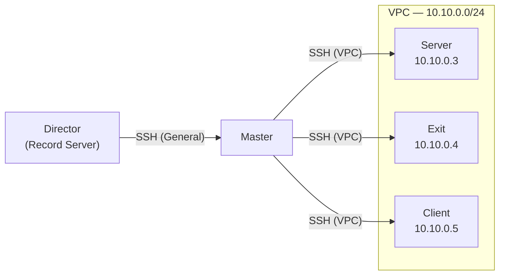

# Test Ortamı

Video Vitrin bölümündeki tüm terminal kayıtları kontrollü bir test ortamında
kaydedilmiştir. Bu sayfa, kayıt altyapısını, ağ mimarisini ve tasarım tercihlerinin
arkasındaki mantığı açıklamaktadır.

---

## Altyapı

FRA1 (Frankfurt) veri merkezi bölgesinde dört adet sunucu konumlandırılmıştır.
Her sunucu, aynı teknik özelliklere sahip minimal bir Debian kurulumu çalıştırmaktadır.

| Rol    | Sunucu Adı (hostname) | İşletim Sistemi |
|--------|-----------------------|-----------------|
| Master | master                | Debian 13 x64   |
| Server | server                | Debian 13 x64   |
| Exit   | exit                  | Debian 13 x64   |
| Client | client                | Debian 13 x64   |

[](https://www.digitalocean.com/?refcode=d96aacce70d1&utm_campaign=Referral_Invite&utm_medium=Referral_Program&utm_source=badge)

---

## Ağ Mimarisi



VPC (Virtual Private Cloud), Master ile diğer üç sunucu arasında özel bir
`10.10.0.0/24` alt ağı oluşturur. Director makinesi Master'a genel internet
üzerinden bağlanır; sonraki tüm bağlantılar VPC üzerinden gerçekleşir.

| Sunucu | VPC Adresi  |
|--------|-------------|
| Server | 10.10.0.3   |
| Exit   | 10.10.0.4   |
| Client | 10.10.0.5   |

```
Director --> SSH (Genel) --> Master --> SSH (VPC) --> Server | Client | Exit
```

---

## Gerçeklik ve Ortam Yaşam Döngüsü

Bu bölümde yer alan kayıtlar tam anlamıyla gerçek uygulama senaryolarını yansıtmaktadır.
Tüm işlemler yukarıda tanımlanan test ortamında, gerçek sunucular üzerinde, gerçek ağ
koşullarında gerçekleştirilmiş ve kayda alınmıştır. Herhangi bir simülasyon veya
sahte çıktı kullanılmamıştır.

Kayıt süreci tamamlandıktan sonra test ortamı tamamen kaldırılmıştır (destroy). Ortam
yalnızca bu kayıtların alınması amacıyla oluşturulmuş ve kullanım amacına ulaştıktan
sonra sonlandırılmıştır.
