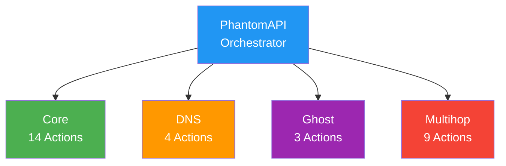
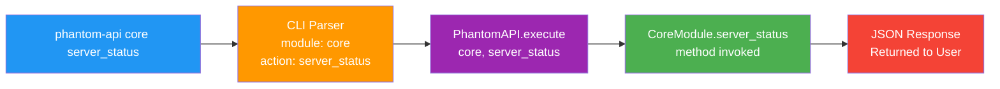

# Phantom-WG API Documentation

```bash
██████╗ ██╗  ██╗ █████╗ ███╗   ██╗████████╗ ██████╗ ███╗   ███╗
██╔══██╗██║  ██║██╔══██╗████╗  ██║╚══██╔══╝██╔═══██╗████╗ ████║
██████╔╝███████║███████║██╔██╗ ██║   ██║   ██║   ██║██╔████╔██║
██╔═══╝ ██╔══██║██╔══██║██║╚██╗██║   ██║   ██║   ██║██║╚██╔╝██║
██║     ██║  ██║██║  ██║██║ ╚████║   ██║   ╚██████╔╝██║ ╚═╝ ██║
╚═╝     ╚═╝  ╚═╝╚═╝  ╚═╝╚═╝  ╚═══╝   ╚═╝    ╚═════╝ ╚═╝     ╚═╝
Copyright (c) 2025 Rıza Emre ARAS <r.emrearas@proton.me>
Licensed under AGPL-3.0 - see LICENSE file for details
Third-party licenses - see THIRD_PARTY_LICENSES file for details
WireGuard® is a registered trademark of Jason A. Donenfeld.
```

## Table of Contents

- **Getting Started**
  - [Overview](#overview)
  - [Basic Syntax](#basic-syntax)
  - [Response Format](#response-format)
- **Modules**
  - [Core Module](#core-module)
  - [DNS Module](#dns-module)
  - [Ghost Module](#ghost-module)
  - [Multihop Module](#multihop-module)
- **Reference**
  - [Factory Reset](#factory-reset)
  - [Common Operations](#common-operations)
  - [Advanced Usage](#advanced-usage)
  - [Version Information](#version-information)

---

## Overview

Phantom-WG is a modular tool that allows you to set up and manage a WireGuard-based
VPN infrastructure on your own server. Beyond basic VPN management, it offers advanced
features such as DNS management synchronized with client configurations, censorship-resistant
connections by masking WireGuard traffic through wstunnel, and traffic routing through
external WireGuard endpoints.

These advanced features are delivered through four main modules:

- **Core** — Core VPN management. Covers client add/remove, configuration export, service
  control, firewall management, and network settings.
- **DNS** — Centralized DNS management. Manages DNS server configuration for all clients;
  changes are instantly reflected across all client profiles.
- **Ghost** — Censorship resistance. Tunnels WireGuard traffic over HTTPS via wstunnel,
  making it indistinguishable from standard web traffic.
- **Multihop** — Multi-hop routing. Routes traffic through external VPN exits, concealing
  the source-destination relationship and preventing any single point from seeing the entire flow.

### Module Architecture

PhantomAPI serves as the central orchestrator across all modules. Each module independently
executes operations (actions) within its area of expertise; PhantomAPI routes incoming
requests to the appropriate module and returns responses in a standardized format.



This architecture enables:
- Independent development and testing of each module
- Easy addition of new modules to the system
- Consistent response format across all modules

### API Request Processing

When an API call is made, the request follows this flow:

1. **Command Input** — User runs `phantom-api <module> <action>` command in the terminal
2. **CLI Parsing** — CLI tool analyzes the command, separating module, action, and parameters
3. **API Routing** — Request is forwarded to the PhantomAPI orchestrator
4. **Module Invocation** — The relevant method of the appropriate module is called and the operation is performed
5. **Response Generation** — Result is structured in standard JSON format and returned



The system can be accessed through two different methods:

- **CLI** — Rich TUI-based interactive interface launched with the `phantom-wg` command.
  Provides step-by-step guided menus for each module, color-coded status indicators, and
  paginated lists. Designed for users who want to manage the server without requiring
  technical knowledge. CLI preview recordings in this documentation show the interactive
  flow of the respective operations.

- **API** — Programmatic interface accessed via the `phantom-api` command. Each call returns
  a standard JSON response, enabling easy scripting, automation, cron jobs, and external
  integrations.

Both methods use the same underlying module infrastructure; any operation available in the
CLI can also be performed via the API.

---

## Basic Syntax

```bash
phantom-api <module> <action> [key=value ...]
```

---

## Response Format

All API responses follow a consistent JSON structure. This allows responses from different
modules and actions to be parsed using the same logic:

```json
{
  "success": true,
  "data": {
    "...": "Action-specific response data"
  },
  "metadata": {
    "module": "module_name",
    "action": "action_name",
    "timestamp": "2025-01-29T12:00:00Z",
    "version": "core-v1"
  }
}
```

Error responses:

```json
{
  "success": false,
  "error": "Error message",
  "code": "ERROR_CODE",
  "metadata": {
    "module": "module_name",
    "action": "action_name",
    "timestamp": "2025-01-29T12:00:00Z",
    "version": "core-v1"
  }
}
```

---

## Core Module

The Core module is the fundamental building block of Phantom-WG. The WireGuard server's
lifecycle (client add/remove, configuration export, service management, firewall control,
subnet changes, and advanced behavior settings) is managed through this module.

### Add Client

<details>
<summary>CLI Preview</summary>


</details>

```bash
phantom-api core add_client client_name="john-laptop"
```

**Parameters:**
- `client_name` (required): May contain alphanumeric characters, hyphens, and underscores

**Response:**
```json
{
  "success": true,
  "data": {
    "client": {
      "name": "john-laptop",
      "ip": "10.8.0.2",
      "public_key": "SKv9YRp0MgHuMCthVIMBRs4Jfwb+mO3vbfvm9jOrLSY=",
      "created": "2025-09-09T01:14:22.076656",
      "enabled": true
    },
    "message": "Client added successfully"
  },
  "metadata": {
    "module": "core",
    "action": "add_client",
    "timestamp": "2025-09-09T01:14:22.119132Z",
    "version": "core-v1"
  }
}
```

### Remove Client

<details>
<summary>CLI Preview</summary>


</details>

```bash
phantom-api core remove_client client_name="john-laptop"
```

**Parameters:**
- `client_name` (required): Name of the client to remove


**Response:**
```json
{
  "success": true,
  "data": {
    "removed": true,
    "client_name": "john-laptop",
    "client_ip": "10.8.0.2"
  },
  "metadata": {
    "module": "core",
    "action": "remove_client",
    "timestamp": "2025-09-09T01:16:45.684652Z",
    "version": "core-v1"
  }
}
```

### List Clients

<details>
<summary>CLI Preview</summary>


</details>

```bash
# List first 10 clients
phantom-api core list_clients

# List page 2 with 20 items per page
phantom-api core list_clients page=2 per_page=20

# Search clients
phantom-api core list_clients search="john"
```

**Parameters:**
- `page` (optional, default=1): Page number
- `per_page` (optional, default=10): Items per page
- `search` (optional): Search term


**Response:**
```json
{
  "success": true,
  "data": {
    "total": 1,
    "clients": [
      {
        "name": "john-laptop",
        "ip": "10.8.0.2",
        "enabled": true,
        "created": "2025-09-09T01:14:22.076656",
        "connected": false
      }
    ],
    "pagination": {
      "page": 1,
      "per_page": 10,
      "total_pages": 1,
      "has_next": false,
      "has_prev": false,
      "showing_from": 1,
      "showing_to": 1
    }
  },
  "metadata": {
    "module": "core",
    "action": "list_clients",
    "timestamp": "2025-09-09T01:14:32.551562Z",
    "version": "core-v1"
  }
}
```

### Export Client Configuration

<details>
<summary>CLI Preview</summary>


</details>

```bash
# Export client configuration
phantom-api core export_client client_name="john-laptop"
```

**Parameters:**
- `client_name` (required): Client to export


**Response:**
```json
{
  "success": true,
  "data": {
    "client": {
      "name": "john-laptop",
      "ip": "10.8.0.2",
      "created": "2025-09-09T01:14:22.076656",
      "enabled": true,
      "private_key": "INPOjXGUqhzPsS4rE65U7Ao6UXdhXNqwDoQz8HgD53s=",
      "public_key": "SKv9YRp0MgHuMCthVIMBRs4Jfwb+mO3vbfvm9jOrLSY=",
      "preshared_key": "y43/xUvLJBHe7RvsGFoHnURcTzWwrEOcJxx/tT+GQVo="
    },
    "config": "
      [Interface]
      PrivateKey = INPOjXGUqhzPsS4rE65U7Ao6UXdhXNqwDoQz8HgD53s=
      Address = 10.8.0.2/24
      DNS = 8.8.8.8, 8.8.4.4
      MTU = 1420

      [Peer]
      PublicKey = Y/V6vf2w+AWpqz3h6DYAOHuW3ZJ3vZ0jSc8D0edVthw=
      PresharedKey = y43/xUvLJBHe7RvsGFoHnURcTzWwrEOcJxx/tT+GQVo=
      Endpoint = 157.230.114.231:51820
      AllowedIPs = 0.0.0.0/0, 10.8.0.0/24
      PersistentKeepalive = 25
    "
  },
  "metadata": {
    "module": "core",
    "action": "export_client",
    "timestamp": "2025-09-09T01:14:43.740027Z",
    "version": "core-v1"
  }
}
```

**Note:** Configuration is dynamically generated from the database and current DNS settings.
QR code generation is available in the CLI interface.

### Server Status

<details>
<summary>CLI Preview</summary>


</details>

```bash
phantom-api core server_status
```

**Response:**
```json
{
  "success": true,
  "data": {
    "service": {
      "running": true,
      "service_name": "wg-quick@wg_main",
      "started_at": "Tue 2025-09-09 01:11:47 UTC",
      "pid": "0"
    },
    "interface": {
      "active": true,
      "interface": "wg_main",
      "peers": [
        {
          "public_key": "SKv9YRp0MgHuMCthVIMBRs4Jfwb+mO3vbfvm9jOrLSY=",
          "preshared_key": "(hidden)",
          "allowed_ips": "10.8.0.2/32"
        }
      ],
      "public_key": "Y/V6vf2w+AWpqz3h6DYAOHuW3ZJ3vZ0jSc8D0edVthw=",
      "port": 51820,
      "rx_bytes": 0,
      "tx_bytes": 0
    },
    "configuration": {
      "interface": "wg_main",
      "config_file": "/etc/wireguard/wg_main.conf",
      "port": 51820,
      "network": "10.8.0.0/24",
      "dns": [
        "8.8.8.8",
        "8.8.4.4"
      ],
      "config_exists": true
    },
    "clients": {
      "total_configured": 1,
      "enabled_clients": 1,
      "disabled_clients": 0,
      "active_connections": 0
    },
    "system": {
      "install_dir": "/opt/phantom-wg",
      "config_dir": "/opt/phantom-wg/config",
      "data_dir": "/opt/phantom-wg/data",
      "firewall": {
        "status": "active"
      },
      "wireguard_module": true
    }
  },
  "metadata": {
    "module": "core",
    "action": "server_status",
    "timestamp": "2025-09-09T01:15:03.512070Z",
    "version": "core-v1"
  }
}
```

### Service Logs

<details>
<summary>CLI Preview</summary>


</details>

```bash
# Get last 50 lines (default)
phantom-api core service_logs

# Get last 100 lines
phantom-api core service_logs lines=100
```

**Parameters:**
- `lines` (optional, default=50): Number of log lines

### Latest Clients

<details>
<summary>CLI Preview</summary>


</details>

```bash
# Get last 5 clients (default)
phantom-api core latest_clients

# Get last 10 clients
phantom-api core latest_clients count=10
```

**Parameters:**
- `count` (optional, default=5): Number of clients

### Restart Service

**Warning:** All connected clients will be temporarily disconnected during restart.

<details>
<summary>CLI Preview</summary>


</details>

```bash
phantom-api core restart_service
```


**Response:**
```json
{
  "success": true,
  "data": {
    "restarted": true,
    "service_active": true,
    "interface_up": true,
    "message": "Service restarted successfully"
  }
}
```

### Firewall Status

<details>
<summary>CLI Preview</summary>


</details>

```bash
phantom-api core get_firewall_status
```

**Response:**
```json
{
  "success": true,
  "data": {
    "ufw": {
      "enabled": true,
      "rules": [
        "51820/udp                  ALLOW IN    Anywhere",
        "51820/udp (v6)             ALLOW IN    Anywhere (v6)"
      ]
    },
    "iptables": {
      "has_rules": true,
      "nat_rules": [],
      "filter_rules": []
    },
    "nat": {
      "enabled": true,
      "rules": [
        "MASQUERADE  0    --  10.8.0.0/24          0.0.0.0/0"
      ]
    },
    "ports": {
      "wireguard_port": 51820,
      "listening": true
    },
    "status": "active"
  },
  "metadata": {
    "module": "core",
    "action": "get_firewall_status",
    "timestamp": "2025-07-11T05:15:59.611420Z",
    "version": "core-v1"
  }
}
```

### Tweak Settings

<details>
<summary>CLI Preview</summary>


</details>

```bash
# Get all tweak settings
phantom-api core get_tweak_settings

# Update a specific setting
phantom-api core update_tweak_setting setting_name="restart_service_after_client_creation" value=false
```

**Parameters for update_tweak_setting:**
- `setting_name` (required): Name of the setting to update
- `value` (required): New value (boolean as string: "true"/"false")

**Available Settings:**
- `restart_service_after_client_creation`: Whether to restart WireGuard service when adding clients
  (default: false)
  - When `false`: Uses `wg set` command to dynamically add clients (no service restart)
  - When `true`: Restarts the entire WireGuard service (causes temporary disconnection for all clients)

**Response for get_tweak_settings:**
```json
{
  "success": true,
  "data": {
    "restart_service_after_client_creation": false,
    "restart_service_after_client_creation_description": "Restart WireGuard service after adding & removing clients (causes connection drops)"
  }
}
```

### Change Default Subnet

<details>
<summary>CLI Preview</summary>


</details>

```bash
# Get current subnet info
phantom-api core get_subnet_info

# Validate a new subnet
phantom-api core validate_subnet_change new_subnet="192.168.100.0/24"

# Change subnet (requires confirmation)
phantom-api core change_subnet new_subnet="192.168.100.0/24" confirm=true
```


**Response for get_subnet_info:**
```json
{
  "success": true,
  "data": {
    "current_subnet": "10.8.0.0/24",
    "subnet_size": 254,
    "usable_ips": 254,
    "network_address": "10.8.0.0",
    "broadcast_address": "10.8.0.255",
    "netmask": "255.255.255.0",
    "prefixlen": 24,
    "clients": {
      "total": 1,
      "active": 0,
      "ip_usage_percentage": 0.39
    },
    "server_ip": "10.8.0.1",
    "first_client_ip": "10.8.0.2",
    "last_client_ip": "10.8.0.254",
    "can_change": true,
    "blockers": {
      "ghost_mode": false,
      "multihop": false,
      "active_connections": false
    },
    "main_interface": {
      "interface": "eth0",
      "ip": "165.227.146.222",
      "network": "165.227.146.222/20"
    },
    "warnings": [
      "WireGuard service will be restarted",
      "Firewall rules will be updated",
      "Brief connectivity interruption expected"
    ]
  },
  "metadata": {
    "module": "core",
    "action": "get_subnet_info",
    "timestamp": "2025-07-11T05:17:09.346288Z",
    "version": "core-v1"
  }
}
```

**Response for validate_subnet_change:**
```json
{
  "success": true,
  "data": {
    "valid": true,
    "new_subnet": "192.168.100.0/24",
    "current_subnet": "10.8.0.0/24",
    "checks": {
      "subnet_size": {
        "valid": true,
        "usable_ips": 254,
        "prefixlen": 24
      },
      "private_subnet": {
        "valid": true,
        "private_range": "192.168.0.0/16"
      },
      "network_conflicts": {
        "valid": true,
        "conflicts": []
      },
      "capacity": {
        "valid": true,
        "usable_ips": 254,
        "required_ips": 2,
        "utilization_after": 0.39
      }
    },
    "warnings": [],
    "errors": [],
    "ip_mapping_preview": {
      "total_mappings": 2,
      "mappings": {
        "server": {
          "old": "10.8.0.1",
          "new": "192.168.100.1"
        },
        "test-api-demo": {
          "old": "10.8.0.2",
          "new": "192.168.100.2"
        }
      }
    }
  },
  "metadata": {
    "module": "core",
    "action": "validate_subnet_change",
    "timestamp": "2025-07-11T05:17:17.124283Z",
    "version": "core-v1"
  }
}
```

**Response for change_subnet:**
```json
{
  "success": true,
  "data": {
    "success": true,
    "old_subnet": "10.8.0.0/24",
    "new_subnet": "192.168.100.0/24",
    "clients_updated": 5,
    "backup_id": "subnet_change_1738257600",
    "ip_mapping": {
      "10.8.0.1": "192.168.100.1",
      "10.8.0.2": "192.168.100.2",
      "10.8.0.3": "192.168.100.3"
    },
    "message": "Successfully changed subnet from 10.8.0.0/24 to 192.168.100.0/24"
  }
}
```

**Important Notes:**
- Subnet changes are blocked when Ghost Mode or Multihop is active
- All clients will be disconnected during the change
- Client configurations are automatically updated
- Firewall rules (iptables and UFW) are automatically updated
- Full backup is created before changes
- Automatic rollback on error

---

## DNS Module

<details>
<summary>CLI Preview</summary>


</details>

### Change DNS Servers

Updates the primary and/or secondary DNS servers that all clients will use.
Changes are instantly reflected across all client configurations.

```bash
# Change both DNS servers
phantom-api dns change_dns_servers primary="1.1.1.1" secondary="1.0.0.1"

# Change only primary DNS
phantom-api dns change_dns_servers primary="8.8.8.8"
```

**Parameters:**
- `primary` (optional): Primary DNS server IP
- `secondary` (optional): Secondary DNS server IP


**Response:**
```json
{
  "success": true,
  "data": {
    "success": true,
    "dns_servers": {
      "primary": "1.1.1.1",
      "secondary": "1.0.0.1",
      "previous_primary": "8.8.8.8",
      "previous_secondary": "1.1.1.1"
    },
    "client_configs_updated": {
      "success": true,
      "message": "DNS configuration updated globally"
    }
  },
  "metadata": {
    "module": "dns",
    "action": "change_dns_servers",
    "timestamp": "2025-07-11T05:17:32.309051Z",
    "version": "core-v1"
  }
}
```

### Test DNS Servers

```bash
# Test configured servers
phantom-api dns test_dns_servers

# Test specific servers
phantom-api dns test_dns_servers servers='["8.8.8.8","1.1.1.1"]'

# Test with a specific domain
phantom-api dns test_dns_servers domain="example.com"
```

**Parameters:**
- `servers` (optional): JSON array of DNS servers
- `domain` (optional, default="google.com"): Test domain

**Response:**
```json
{
  "success": true,
  "data": {
    "all_passed": true,
    "servers_tested": 2,
    "results": [
      {
        "server": "1.1.1.1",
        "success": true,
        "status": "OK",
        "response_time_ms": null,
        "test_domain": "google.com"
      },
      {
        "server": "1.0.0.1",
        "success": true,
        "status": "OK",
        "response_time_ms": null,
        "test_domain": "google.com"
      }
    ]
  },
  "metadata": {
    "module": "dns",
    "action": "test_dns_servers",
    "timestamp": "2025-07-11T05:17:44.423898Z",
    "version": "core-v1"
  }
}
```

### DNS Status

```bash
phantom-api dns status
```

**Response:**
```json
{
  "success": true,
  "data": {
    "mode": "standard",
    "configuration": {
      "primary": "1.1.1.1",
      "secondary": "1.0.0.1"
    },
    "health": {
      "status": "healthy",
      "test_results": [
        {
          "server": "1.1.1.1",
          "tests": [
            {
              "domain": "google.com",
              "success": "142.250.184.206",
              "response": "142.250.184.206",
              "error": null
            },
            {
              "domain": "cloudflare.com",
              "success": "104.16.133.229",
              "response": "104.16.133.229",
              "error": null
            }
          ]
        },
        {
          "server": "1.0.0.1",
          "tests": [
            {
              "domain": "google.com",
              "success": "142.250.184.206",
              "response": "142.250.184.206",
              "error": null
            },
            {
              "domain": "cloudflare.com",
              "success": "104.16.132.229",
              "response": "104.16.132.229",
              "error": null
            }
          ]
        }
      ]
    }
  },
  "metadata": {
    "module": "dns",
    "action": "status",
    "timestamp": "2025-07-11T05:17:52.286147Z",
    "version": "core-v1"
  }
}
```

### Get DNS Servers

```bash
phantom-api dns get_dns_servers
```

**Response:**
```json
{
  "success": true,
  "data": {
    "primary": "8.8.8.8",
    "secondary": "1.1.1.1"
  },
  "metadata": {
    "module": "dns",
    "action": "get_dns_servers",
    "timestamp": "2025-07-11T05:17:24.846383Z",
    "version": "core-v1"
  }
}
```

---

## Ghost Module

<details>
<summary>CLI Preview</summary>


</details>

### Enable Ghost Mode

```bash
# Enable with custom domain
phantom-api ghost enable domain="cdn.example.com"

# Enable with sslip.io (automatic wildcard SSL)
phantom-api ghost enable domain="157-230-114-231.sslip.io"
```

**Parameters:**
- `domain` (required): Domain with A record pointing to the server (supports sslip.io/nip.io)

**Response:**
```json
{
  "success": true,
  "data": {
    "status": "active",
    "server_ip": "157.230.114.231",
    "domain": "157-230-114-231.sslip.io",
    "secret": "Ui1RVMCxicaByr7C5XrgqS5yCilLmkCAXMcF8oZP4ZcVkQAvZhRCht3hsHeJENac",
    "protocol": "wss",
    "port": 443,
    "activated_at": "2025-09-09T01:41:24.079841",
    "connection_command": "wstunnel client --http-upgrade-path-prefix \"Ui1RVMCxicaByr7C5XrgqS5yCilLmkCAXMcF8oZP4ZcVkQAvZhRCht3hsHeJENac\" -L udp://127.0.0.1:51820:127.0.0.1:51820 wss://157-230-114-231.sslip.io:443"
  },
  "metadata": {
    "module": "ghost",
    "action": "enable",
    "timestamp": "2025-09-09T01:41:32.236798Z",
    "version": "core-v1"
  }
}
```

**Notes:**
- `secret` is a unique token generated for secure WebSocket tunneling
- `connection_command` shows the complete wstunnel command that clients need to run

### Disable Ghost Mode

```bash
phantom-api ghost disable
```

**Response:**
```json
{
  "success": true,
  "data": {
    "status": "inactive",
    "message": "Ghost Mode disabled successfully",
    "restored": true
  },
  "metadata": {
    "module": "ghost",
    "action": "disable",
    "timestamp": "2025-09-09T01:43:07.217952Z",
    "version": "core-v1"
  }
}
```

**Notes:**
- Restores direct WireGuard connection on port 51820
- All clients automatically revert to standard WireGuard configuration

### Ghost Mode Status

```bash
phantom-api ghost status
```

**Response (Inactive):**
```json
{
  "success": true,
  "data": {
    "status": "inactive",
    "enabled": false,
    "message": "Ghost Mode is not active"
  },
  "metadata": {
    "module": "ghost",
    "action": "status",
    "timestamp": "2025-09-09T01:16:11.292837Z",
    "version": "core-v1"
  }
}
```

**Exporting Client Configuration with Casper Tool:**

When Ghost Mode is active, clients need to run both a wstunnel client and use a special
WireGuard configuration to connect. The `phantom-casper` tool is a standalone utility
that provides both components together with step-by-step instructions:

```bash
# Export client configuration for Ghost Mode
phantom-casper [username]

# Example with actual client
phantom-casper demo-casper
```

**Example Output:**
```
================================================================================
PHANTOM-WG - GHOST MODE CLIENT CONFIGURATION
================================================================================

Client: demo-casper
Server: 157-230-114-231.sslip.io
Created: 2025-09-09 01:41:50

--------------------------------------------------------------------------------
STEP 1: Start wstunnel client
--------------------------------------------------------------------------------

Run this command in a separate terminal (keep it running):

    wstunnel client --http-upgrade-path-prefix "Ui1RVMCxicaByr7C5XrgqS5yCilLmkCAXMcF8oZP4ZcVkQAvZhRCht3hsHeJENac" \
        -L udp://127.0.0.1:51820:127.0.0.1:51820 wss://157-230-114-231.sslip.io:443

--------------------------------------------------------------------------------
STEP 2: WireGuard Configuration
--------------------------------------------------------------------------------

Save the following configuration to a file (e.g., phantom-ghost.conf):

[Interface]
PrivateKey = SI5AXDC9e5ERFwUKBr391MAwSeHIebG4l7R+N7xssVg=
Address = 10.8.0.2/24
DNS = 8.8.8.8, 8.8.4.4
MTU = 1420

[Peer]
PublicKey = Y/V6vf2w+AWpqz3h6DYAOHuW3ZJ3vZ0jSc8D0edVthw=
PresharedKey = giiS7QdcN708ovmXPfrikpC+TI4lqQcXTJ5JFfqL06k=
Endpoint = 127.0.0.1:51820
AllowedIPs = 0.0.0.0/1, 128.0.0.0/4, 144.0.0.0/5, 152.0.0.0/6, 156.0.0.0/8,
            157.0.0.0/9, 157.128.0.0/10, 157.192.0.0/11, 157.224.0.0/14,
            157.228.0.0/15, 157.230.0.0/18, 157.230.64.0/19, 157.230.96.0/20,
            157.230.112.0/23, 157.230.114.0/25, 157.230.114.128/26,
            157.230.114.192/27, 157.230.114.224/30, 157.230.114.228/31,
            157.230.114.230/32, 157.230.114.232/29, 157.230.114.240/28,
            157.230.115.0/24, 157.230.116.0/22, 157.230.120.0/21,
            157.230.128.0/17, 157.231.0.0/16, 157.232.0.0/13, 157.240.0.0/12,
            158.0.0.0/7, 160.0.0.0/3, 192.0.0.0/2, 10.8.0.0/24
PersistentKeepalive = 25

--------------------------------------------------------------------------------
STEP 3: Connect
--------------------------------------------------------------------------------

Linux/macOS:
    sudo wg-quick up /path/to/phantom-ghost.conf

Windows:
    Import the configuration file in the WireGuard client

To disconnect:
    sudo wg-quick down /path/to/phantom-ghost.conf

================================================================================
NOTE: Keep the wstunnel command running while connected!
================================================================================
```

**Key Features of the Casper Tool:**
- Automatically calculates split routing (AllowedIPs) to exclude server IP --
  this ensures the wstunnel connection itself doesn't go through the VPN tunnel,
  preventing circular routing
- Generates wstunnel client command with correct secret path
- Provides step-by-step connection instructions per platform (Linux/macOS)
- Works with any domain configured in Ghost Mode (including sslip.io/nip.io)
- Endpoint is set to 127.0.0.1:51820; traffic is forwarded to the remote server
  through the local wstunnel client

---

## Multihop Module

The Multihop module routes client traffic through an external VPN provider before
exiting the Phantom server, providing dual-layer encryption and location concealment.
Traffic flow is as follows:

```
Client → Phantom Server (1st encryption) → External VPN Exit (2nd encryption) → Internet
```

This architecture ensures that the destination server only sees the IP address of the
external VPN exit point; the real address of the Phantom server or client remains hidden.
Multihop works by importing standard WireGuard configuration files, making it compatible
with any VPN provider that supports WireGuard.

<details>
<summary>CLI Preview</summary>


</details>

### Import VPN Configuration

```bash
# Import with automatic name detection
phantom-api multihop import_vpn_config config_path="/home/user/xeovo-uk.conf"

# Import with custom name
phantom-api multihop import_vpn_config config_path="/home/user/vpn.conf" custom_name="xeovo-uk"
```

**Parameters:**
- `config_path` (required): Path to WireGuard configuration file
- `custom_name` (optional): Custom name for the configuration

### Enable Multihop

```bash
phantom-api multihop enable_multihop exit_name="xeovo-uk"
```

**Parameters:**
- `exit_name` (required): Name of the VPN exit point to use


**Response:**
```json
{
  "success": true,
  "data": {
    "exit_name": "xeovo-uk",
    "multihop_enabled": true,
    "handshake_established": true,
    "connection_verified": true,
    "monitor_started": true,
    "traffic_flow": "Clients → Phantom → VPN Exit (185.213.155.134:51820)",
    "peer_access": "Peers can still connect directly",
    "message": "Multihop successfully enabled via xeovo-uk"
  }
}
```

### Disable Multihop

```bash
phantom-api multihop disable_multihop
```

### List Exit Points

```bash
phantom-api multihop list_exits
```

**Response:**
```json
{
  "success": true,
  "data": {
    "exits": [
      {
        "name": "xeovo-uk",
        "endpoint": "uk.gw.xeovo.com:51820",
        "active": false,
        "provider": "Unknown Provider",
        "imported_at": "2025-09-09T01:16:21.977967",
        "multihop_enhanced": true
      }
    ],
    "multihop_enabled": false,
    "active_exit": null,
    "total": 1
  },
  "metadata": {
    "module": "multihop",
    "action": "list_exits",
    "timestamp": "2025-09-09T01:16:30.162946Z",
    "version": "core-v1"
  }
}
```

### Remove VPN Configuration

```bash
phantom-api multihop remove_vpn_config exit_name="xeovo-uk"
```

**Parameters:**
- `exit_name` (required): Name of the VPN configuration to remove

### Multihop Status

```bash
phantom-api multihop status
```

**Response (Inactive):**
```json
{
  "success": true,
  "data": {
    "enabled": false,
    "active_exit": null,
    "available_configs": 1,
    "vpn_interface": {
      "active": false,
      "error": "VPN interface not active"
    },
    "monitor_status": {
      "monitoring": false,
      "type": null,
      "pid": null
    },
    "traffic_routing": "Direct",
    "traffic_flow": "Clients -> Phantom Server -> Internet (direct)"
  },
  "metadata": {
    "module": "multihop",
    "action": "status",
    "timestamp": "2025-09-09T01:16:37.646761Z",
    "version": "core-v1"
  }
}
```

### Test VPN Connection

```bash
# Test active VPN
phantom-api multihop test_vpn
```

### Reset Multihop State

```bash
phantom-api multihop reset_state
```

### Get Session Log

```bash
# Get last 50 lines (default)
phantom-api multihop get_session_log

# Get last 100 lines
phantom-api multihop get_session_log lines=100
```

---

## Factory Reset

A standalone factory reset script is used to restore Phantom-WG to its initial
installation state. This operation is performed not via the API, but by running a script
directly on the server:

```bash
/opt/phantom-wg/phantom/factory-reset.sh
```

This script performs the following operations in sequence:
- Stops all active services (Ghost Mode, Multihop, WireGuard)
- Deletes all client configurations and key information
- Removes all logs, state files, and session data
- Generates new server key pair
- Resets the system to initial installation state
- Preserves SSH port configuration (your server access won't be interrupted)

**Warning:** This is an irreversible operation. No backup is created and all data is
permanently deleted. Factory reset should only be used when you want to completely
reset the system.

---

## Common Operations

The following examples demonstrate how the API can be combined with shell scripts and
standard Unix tools to automate daily management tasks.

### Create Multiple Clients

```bash
# Create 100 test clients
for i in {1..100}; do
    phantom-api core add_client client_name="test-client-$i"
done
```

### Export All Client Configurations

```bash
# Export all clients as configuration files
phantom-api core list_clients per_page=1000 | jq -r '.data.clients[].name' | while read client; do
    phantom-api core export_client client_name="$client"
done
```

### Enable Full Censorship Resistance

Ghost Mode and Multihop can be used together to achieve the highest level of censorship
resistance. In this scenario, traffic first passes through an HTTPS tunnel, then reaches
the internet through an external VPN exit.

```bash
# 1. Enable Ghost Mode
phantom-api ghost enable domain="cdn.example.com"

# 2. Import external VPN
phantom-api multihop import_vpn_config config_path="/path/to/vpn-exit.conf"

# 3. Enable Multihop
phantom-api multihop enable_multihop exit_name="vpn-exit"
```

### Full System Check

```bash
# Check all components
phantom-api core server_status
phantom-api dns status
phantom-api ghost status
phantom-api multihop status
```

---

## Advanced Usage

The API's JSON output can be easily parsed with tools like `jq` to create monitoring
scripts, automation workflows, and custom dashboards.

### Parse JSON Responses

```bash
# Get client count
phantom-api core list_clients | jq '.data.total'

# Get active connections
phantom-api core server_status | jq '.data.clients.active_connections'

# Check if Ghost Mode is active
phantom-api ghost status | jq '.data.enabled'
```

### Health Monitoring

The following script checks the status of all critical components and alerts when
issues are detected. It can be run as a cron job for continuous monitoring.

```bash
#!/bin/bash
# Monitor system health

# Check WireGuard service
if ! phantom-api core server_status | jq -e '.data.service.running' > /dev/null; then
    echo "WARNING: WireGuard service is not running!"
fi

# Check DNS health
if ! phantom-api dns test_dns_servers | jq -e '.data.all_passed' > /dev/null; then
    echo "WARNING: DNS servers are not responding!"
fi

# Check Multihop if enabled
if phantom-api multihop status | jq -e '.data.enabled' > /dev/null; then
    if ! phantom-api multihop test_vpn | jq -e '.data.all_tests_passed' > /dev/null; then
        echo "WARNING: Multihop VPN test failed!"
    fi
fi
```

---

## Version Information

This documentation covers Phantom-WG API **core-v1**.

> **Note:** Server information, IP addresses, and client data shown in CLI preview
> recordings in this documentation were generated on a test server that was temporarily
> set up solely for creating this content and has been permanently shut down afterward.

---

<!--suppress HtmlDeprecatedAttribute -->

<div align="center">


</div>