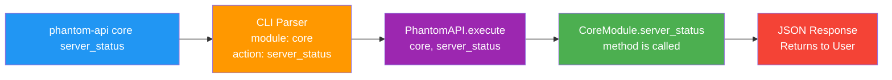
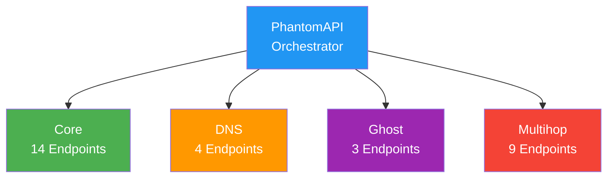
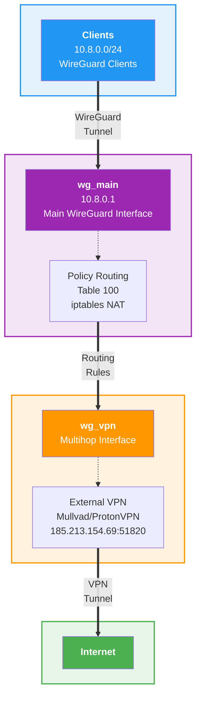
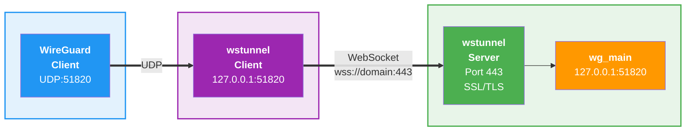

# Phantom-WireGuard Modules 🇺🇸

```bash
██████╗ ██╗  ██╗ █████╗ ███╗   ██╗████████╗ ██████╗ ███╗   ███╗
██╔══██╗██║  ██║██╔══██╗████╗  ██║╚══██╔══╝██╔═══██╗████╗ ████║
██████╔╝███████║███████║██╔██╗ ██║   ██║   ██║   ██║██╔████╔██║
██╔═══╝ ██╔══██║██╔══██║██║╚██╗██║   ██║   ██║   ██║██║╚██╔╝██║
██║     ██║  ██║██║  ██║██║ ╚████║   ██║   ╚██████╔╝██║ ╚═╝ ██║
╚═╝     ╚═╝  ╚═╝╚═╝  ╚═╝╚═╝  ╚═══╝   ╚═╝    ╚═════╝ ╚═╝     ╚═╝
Copyright (c) 2025 Rıza Emre ARAS <r.emrearas@proton.me>
Licensed under AGPL-3.0 - see LICENSE file for details
Third-party licenses - see THIRD_PARTY_LICENSES file for details
WireGuard® is a registered trademark of Jason A. Donenfeld.
```

## Overview

The Phantom-WireGuard module system implements an architecture where each module provides specialized 
functionality through a standardized API interface. 
All modules inherit from `BaseModule` and expose their capabilities via defined action **endpoints**.

### The Craft Workshop Metaphor

This metaphor helps us understand how the system works by explaining complex technical structures through familiar 
everyday concepts. 
Just like masters, journeymen, and apprentices working in harmony in a traditional craft workshop, each component in
Phantom-WireGuard performs its specialized role and coordinates with others when needed. 
This analogy helps us clearly grasp both the independence of modules and their interactions with each other.

Think of Phantom-WireGuard as a **craft workshop**:

- **Modules = Master Craftsmen:** Each module represents masters specialized in their own field.

  - **Core:** The master craftsman - the chief artisan who establishes and manages VPN connections
  - **DNS:** The pathfinder - the guide showing clients the correct addresses
  - **Ghost:** The stealth master - specialist in the art of invisibility
  - **Multihop:** The route planner - strategist who draws complex route maps and securely transfers traffic through
    these paths

- **Managers = Apprentices and Journeymen:** The assistants working alongside each master
  - Core's 7 journeymen (DataStore, KeyGenerator, ClientHandler, ServiceMonitor, ConfigKeeper, NetworkAdmin,
    CommonTools) each expert in their craft
  - Ghost's assistants (StateManager, SSLUtils, WSTunnelUtils, FirewallUtils, NetworkUtils, DNSUtils) facilitate
    the master's work
  - Multihop's specialists (ConfigHandler, NetworkAdmin, RoutingManager, ServiceManager, StateManager,
    ConnectionTester, SessionLogger) work coordinately to manage complex routes and securely transfer traffic.

- **Methods = Craft Tools:** Special tools used by each master
  - `add_client`: The pen for creating new connections
  - `change_dns_servers`: The compass for changing addresses
  - `enable_ghost`: The invisibility cloak
  - `import_vpn_config`: The tool for importing external route maps

- **phantom.json = Master Ledger:** The main registry where all workshop settings are written

- **TinyDB = Client Registry:** The special ledger containing information about all clients

- **PhantomAPI = Workshop Manager:** The coordinator who directs incoming work to the right masters

### Example Request Flow

#### Step-by-Step Process

1. **User Access:** System administrator connects to the Phantom-WireGuard server via SSH.
   
2. **Command Entry:** Runs the command `phantom-api core server_status` in the terminal.
   
3. **CLI Parsing:** The `phantom-api` CLI tool analyzes the command:
   - Module: `core`
   - Action: `server_status`
   - Parameters: (none in this example)
   
4. **API Routing:** The CLI forwards the request to the PhantomAPI orchestrator.
   
5. **Module Invocation:** PhantomAPI calls the CoreModule class's `server_status()` method.
   
6. **Data Collection:** Core module gathers system information:
   - WireGuard service status is checked.
   - Interface statistics are read.
   - Client connections are analyzed.
   - Configuration information is compiled.
   
7. **Response Creation:** Collected data is structured in JSON format.
   
8. **Result Display:** CLI displays the JSON response in a user-friendly format in the terminal.




## Architecture



## Module Inventory

### 1. Core Module (`core/`)

**Purpose:** Primary WireGuard VPN management and orchestration

**Architecture:** With 7 specialized and expert component libraries along with its unique `Manager Pattern` structure,
each component fully undertakes a specific responsibility and works coordinately with other components.

- **DataStore:** Persistently stores client data on TinyDB, manages IP allocation and subnet mapping operations,
  maintains database integrity.
- **KeyGenerator:** Securely generates all cryptographic keys required for WireGuard (private, public, preshared) and
  performs format validation.
- **CommonTools:** Provides client name validation, IP address validation, system command executor, and general utility
  functions.
- **ClientHandler:** Manages the complete client lifecycle (add, remove, list, export), dynamically updates peer
  configurations. *(Dynamically generates client configurations with ConfigGenerationService helper service)*
- **ServiceMonitor:** Monitors WireGuard and systemd services health status, collects service logs, safely manages
  restart operations.
- **ConfigKeeper:** Manages phantom.json configuration file, updates advanced tweak settings, persists runtime
  changes.
- **NetworkAdmin:** Orchestrates subnet changes, performs IP remapping, safely migrates network configuration.

**API Endpoints (14 total):**
```
Client Management:
├── add_client              - Create new WireGuard client
├── remove_client           - Remove existing client
├── list_clients            - Paginated client list
├── export_client           - Export client configuration
└── latest_clients          - Show recently added clients

Service Management:
├── server_status           - Comprehensive server status
├── service_logs            - WireGuard service logs
├── restart_service         - WireGuard service restart operation
└── get_firewall_status     - Firewall and NAT status

Configuration:
├── get_tweak_settings      - View advanced fine-tuning settings
└── update_tweak_setting    - Modify advanced fine-tuning settings

Network Management:
├── get_subnet_info         - Current subnet information
├── validate_subnet_change  - Pre-validation for subnet changes
└── change_subnet           - Perform subnet transition
```

#### Data Models

##### `WireGuardClient`
**File:** `phantom/modules/core/models/client_models.py`

Client information and client-specific cryptographic keys

```python
@dataclass
class WireGuardClient:
    name: str
    ip: str
    private_key: str
    public_key: str
    preshared_key: str
    created: datetime
    enabled: bool
```

```json
{
  "name": "john-laptop",
  "ip": "10.8.0.2",
  "private_key": "aBcD1234...",
  "public_key": "xYz5678...",
  "preshared_key": "PreShared123...",
  "created": "2025-01-30T10:15:00",
  "enabled": true
}
```

##### `ClientAddResult`
**File:** `phantom/modules/core/models/client_models.py`

Client addition result

```python
@dataclass
class ClientAddResult:
    client: WireGuardClient
    message: str
```

```json
{
  "client": {
    "name": "john-laptop",
    "ip": "10.8.0.2",
    "public_key": "xYz5678...",
    "created": "2025-01-30T10:15:00",
    "enabled": true
  },
  "message": "Client 'john-laptop' added successfully"
}
```

##### `ClientInfo`
**File:** `phantom/modules/core/models/client_models.py`

Client list information

```python
@dataclass
class ClientInfo:
    name: str
    ip: str
    enabled: bool
    created: str
    connected: bool
    connection: Optional[Dict[str, Any]] = None
```

```json
{
  "name": "john-laptop",
  "ip": "10.8.0.2",
  "enabled": true,
  "created": "2025-01-30T10:15:00",
  "connected": true,
  "connection": {
    "latest_handshake": "1 minute ago",
    "transfer_rx": "1.2 GB",
    "transfer_tx": "450 MB"
  }
}
```

##### `ServiceStatus`
**File:** `phantom/modules/core/models/service_models.py`

Service status

```python
@dataclass
class ServiceStatus:
    running: bool
    service_name: str
    started_at: Optional[str] = None
    pid: Optional[str] = None
```

```json
{
  "running": true,
  "service_name": "wg-quick@wg_main",
  "started_at": "2025-01-27 10:15:00",
  "pid": "1234"
}
```

##### `ClientStatistics`
**File:** `phantom/modules/core/models/service_models.py`

Client statistics

```python
@dataclass
class ClientStatistics:
    total_configured: int
    enabled_clients: int
    disabled_clients: int
    active_connections: int
```

```json
{
  "total_configured": 10,
  "enabled_clients": 8,
  "disabled_clients": 2,
  "active_connections": 5
}
```

##### `ServerConfig`
**File:** `phantom/modules/core/models/service_models.py`

Server configuration

```python
@dataclass
class ServerConfig:
    interface: str
    config_file: str
    port: int
    network: str
    dns: List[str]
    config_exists: bool
```

```json
{
  "interface": "wg_main",
  "config_file": "/etc/wireguard/wg_main.conf",
  "port": 51820,
  "network": "10.8.0.0/24",
  "dns": ["8.8.8.8", "1.1.1.1"],
  "config_exists": true
}
```

##### `InterfaceStatistics`
**File:** `phantom/modules/core/models/service_models.py`

WireGuard interface statistics

```python
@dataclass
class InterfaceStatistics:
    active: bool
    interface: str
    peers: List[Dict[str, Any]]
    public_key: Optional[str] = None
    port: Optional[int] = None
    rx_bytes: Optional[int] = None
    tx_bytes: Optional[int] = None
```

```json
{
  "active": true,
  "interface": "wg_main",
  "public_key": "server_public_key_here",
  "port": 51820,
  "rx_bytes": 1234567890,
  "tx_bytes": 987654321,
  "peers": [
    {
      "name": "john-laptop",
      "public_key": "xYz5678...",
      "allowed_ips": "10.8.0.2/32",
      "latest_handshake": "1 minute ago",
      "rx_bytes": 1234567,
      "tx_bytes": 7654321
    }
  ]
}
```

##### `FirewallConfiguration`
**File:** `phantom/modules/core/models/service_models.py`

Firewall status

```python
@dataclass
class FirewallConfiguration:
    ufw: Dict[str, Any]
    iptables: Dict[str, Any]
    nat: Dict[str, Any]
    ports: Dict[str, Any]
    status: str
```

```json
{
  "status": "active",
  "ufw": {
    "status": "active",
    "port_51820": "allowed"
  },
  "iptables": {
    "forward_policy": "ACCEPT",
    "nat_rules": 3
  },
  "nat": {
    "masquerade": "enabled",
    "interface": "eth0"
  },
  "ports": {
    "51820/udp": "open",
    "22/tcp": "open"
  }
}
```

#### State Management

##### Database
**Location:** `/opt/phantom-wireguard/data/clients.db` (TinyDB JSON format)

**clients table example:**
```json
{
  "_default": {
    "1": {
      "name": "john-laptop",
      "ip": "10.8.0.2",
      "private_key": "aBcD1234...",
      "public_key": "xYz5678...",
      "preshared_key": "PreShared123...",
      "created": "2025-01-30T10:15:00",
      "enabled": true
    },
    "2": {
      "name": "alice-phone",
      "ip": "10.8.0.3",
      "private_key": "eFgH5678...",
      "public_key": "MnO9012...",
      "preshared_key": "PreShared456...",
      "created": "2025-01-30T11:30:00",
      "enabled": true
    }
  }
}
```

**ip_assignments table example:**
```json
{
  "_default": {
    "1": {
      "ip": "10.8.0.2",
      "client_name": "john-laptop",
      "assigned_at": "2025-01-30T10:15:00"
    },
    "2": {
      "ip": "10.8.0.3",
      "client_name": "alice-phone",
      "assigned_at": "2025-01-30T11:30:00"
    }
  }
}
```

##### Configuration File
**Location:** `/opt/phantom-wireguard/config/phantom.json`

**Example phantom.json content:**
```json
{
  "version": "core-v1",
  "wireguard": {
    "interface": "wg_main",
    "port": 51820,
    "network": "10.8.0.0/24"
  },
  "server": {
    "ip": "203.0.113.1",
    "private_key": "aBcDeFgHiJkLmNoPqRsTuVwXyZ1234567890ABCDEF=",
    "public_key": "XyZ9876543210aBcDeFgHiJkLmNoPqRsTuVwXyZABC="
  },
  "tweaks": {
    "restart_service_after_client_creation": false
  },
  "dns": {
    "primary": "8.8.8.8",
    "secondary": "8.8.4.4"
  },
  "multihop": {
    "enabled": false,
    "active_exit": null,
    "vpn_interface_name": "wg_vpn",
    "updated_at": "2025-01-30T10:15:00.000000"
  }
}
```

##### Client Configurations
**Dynamic Generation:** Client configurations are not stored in the file system, they are dynamically generated via
`export_client` API call.

**Example configuration generated by ConfigGenerationService:**
```ini
[Interface]
PrivateKey = aBcD1234...
Address = 10.8.0.2/24
DNS = 1.1.1.1, 1.0.0.1
MTU = 1420

[Peer]
PublicKey = [server-public-key]
PresharedKey = PreShared123...
Endpoint = 203.0.113.1:51820
AllowedIPs = 0.0.0.0/0, 10.8.0.0/24
PersistentKeepalive = 25
```

**Note:** Client information is stored in TinyDB, server settings are retrieved from phantom.json and configuration
is created in memory. 
The CLI tool using PhantomAPI generates QR codes from this configuration.

##### WireGuard Server Configuration
**Location:** `/etc/wireguard/wg_main.conf`

**Example server config file:**

```ini
[Interface]
PrivateKey = [server-private-key]
Address = 10.8.0.1/24
ListenPort = 51820
PostUp = iptables -A FORWARD -i %i -j ACCEPT; iptables -t nat -A POSTROUTING -o eth0 -j MASQUERADE
PostDown = iptables -D FORWARD -i %i -j ACCEPT; iptables -t nat -D POSTROUTING -o eth0 -j MASQUERADE

# Client: john-laptop
[Peer]
PublicKey = xYz5678...
PresharedKey = PreShared123...
AllowedIPs = 10.8.0.2/32
```

---

### 2. DNS Module (`dns/`)
**Purpose:** Central DNS server configuration management for all WireGuard clients

**Architecture:** Single module structure, does not use manager pattern. Works directly with phantom.json.

**Note:** The DNS module operates as an independent module. The `ConfigGenerationService` helper service in the Core
module reads DNS information from the phantom.json file when creating client configuration. This way, DNS changes are
automatically reflected in all new client configurations.

**API Endpoints (4 total):**
```
├── change_dns_servers  - Update DNS servers system-wide
├── test_dns_servers    - Test DNS server connectivity and performance
├── status              - Full DNS status and health check
└── get_dns_servers     - Get current DNS configuration
```

**Main Features:**
- IP format validation (NetworkValidator)
- DNS server accessibility tests (nslookup/dig)
- Health status assessment (healthy/degraded)
- Typed model support (BaseModel inheritance)

**Testing Capabilities:**
- DNS resolution test with `nslookup`
- Fast query performance with `dig`
- Custom domain parameter support
- Multiple DNS server testing

#### Data Models

##### `DNSServerConfig`
**File:** `phantom/modules/dns/models/dns_models.py`

DNS server configuration and previous values

```python
@dataclass
class DNSServerConfig:
    primary: str
    secondary: str
    previous_primary: Optional[str] = None
    previous_secondary: Optional[str] = None
```

```json
{
  "primary": "1.1.1.1",
  "secondary": "1.0.0.1",
  "previous_primary": "8.8.8.8",
  "previous_secondary": "8.8.4.4"
}
```

##### `ChangeDNSResult`
**File:** `phantom/modules/dns/models/dns_models.py`

DNS change operation result

```python
@dataclass
class ChangeDNSResult:
    success: bool
    dns_servers: DNSServerConfig
    client_configs_updated: ClientConfigUpdateResult
```

```json
{
  "success": true,
  "dns_servers": {
    "primary": "1.1.1.1",
    "secondary": "1.0.0.1",
    "previous_primary": "8.8.8.8",
    "previous_secondary": "8.8.4.4"
  },
  "client_configs_updated": {
    "success": true,
    "message": "All client configurations updated successfully"
  }
}
```

##### `DNSTestServerResult`
**File:** `phantom/modules/dns/models/dns_models.py`

Single DNS server test result

```python
@dataclass
class DNSTestServerResult:
    server: str
    success: bool
    status: str
    response_time_ms: Optional[float] = None
    test_domain: Optional[str] = None
    error: Optional[str] = None
```

```json
{
  "server": "1.1.1.1",
  "success": true,
  "status": "OK",
  "response_time_ms": 23.5,
  "test_domain": "google.com",
  "error": null
}
```

##### `TestDNSResult`
**File:** `phantom/modules/dns/models/dns_models.py`

All DNS test results

```python
@dataclass
class TestDNSResult:
    all_passed: bool
    servers_tested: int
    results: List[DNSTestServerResult]
```

```json
{
  "all_passed": true,
  "servers_tested": 2,
  "results": [
    {
      "server": "1.1.1.1",
      "success": true,
      "status": "OK",
      "response_time_ms": 23.5,
      "test_domain": "google.com"
    },
    {
      "server": "1.0.0.1",
      "success": true,
      "status": "OK",
      "response_time_ms": 18.2,
      "test_domain": "google.com"
    }
  ]
}
```

##### `DNSStatusResult`
**File:** `phantom/modules/dns/models/dns_models.py`

Comprehensive DNS status information

```python
@dataclass
class DNSStatusResult:
    mode: str
    configuration: DNSConfiguration
    health: DNSHealth
```

```json
{
  "mode": "standard",
  "configuration": {
    "primary": "1.1.1.1",
    "secondary": "1.0.0.1"
  },
  "health": {
    "status": "healthy",
    "test_results": [
      {
        "server": "1.1.1.1",
        "tests": [
          {
            "domain": "google.com",
            "success": true,
            "response": "142.250.185.206"
          },
          {
            "domain": "cloudflare.com",
            "success": true,
            "response": "104.16.132.229"
          }
        ]
      },
      {
        "server": "1.0.0.1",
        "tests": [
          {
            "domain": "google.com",
            "success": true,
            "response": "142.250.185.206"
          },
          {
            "domain": "cloudflare.com",
            "success": true,
            "response": "104.16.132.229"
          }
        ]
      }
    ]
  }
}
```

##### `GetDNSServersResult`
**File:** `phantom/modules/dns/models/dns_models.py`

Active DNS server information

```python
@dataclass
class GetDNSServersResult:
    primary: str
    secondary: str
```

```json
{
  "primary": "8.8.8.8",
  "secondary": "8.8.4.4"
}
```

**Configuration Storage:**
```json
{
  "dns": {
    "primary": "8.8.8.8",
    "secondary": "8.8.4.4"
  }
}
```

**Note:** DNS changes are immediately saved to the phantom.json file and all new client configurations use these
settings.

---
### 3. Multihop Module (`multihop/`)

**Purpose:** Multi-layered routing and enhanced privacy through external VPN providers

**Architecture:** Orchestration system with 7 specialized component classes and 1 helper module. Each component has a
specific area of responsibility and works coordinately.

- **ConfigHandler:** Imports, validates, and optimizes VPN configuration files. Parses WireGuard format configurations.
- **NetworkAdmin:** Manages wg_vpn (multihop) interface, performs IP address assignment, configures systemd-networkd
  settings.
- **RoutingManager:** Manages policy-based routing rules (PBR) and iptables NAT rules. Routes traffic through Table 100.
- **ServiceManager:** Controls phantom-multihop-monitor systemd service, monitors service status.
- **StateManager:** Persists multihop state in phantom.json, ensures configuration consistency.
- **ConnectionTester:** Tests VPN connections, checks handshake status, verifies external IP address.
- **SessionLogger:** Logs all multihop operations, provides session-based tracking.
- **common_tools:** (Module) Contains constants, utility functions, and shared variables. Constants like
  DEFAULT_VPN_DNS, MULTIHOP_TABLE_ID are defined here.

**API Endpoints (9 total):**
```
Configuration Management:
├── import_vpn_config   - Import external VPN configuration
├── remove_vpn_config   - Remove imported configuration
├── list_exits          - List available VPN exit points

Routing Control:
├── enable_multihop     - Enable multihop routing
├── disable_multihop    - Disable multihop routing
└── reset_state         - Reset all multihop state

Status and Testing:
├── status              - Multihop status
├── test_vpn            - Test VPN connection
└── get_session_log     - View session logs
```

#### Data Models

##### `VPNExitInfo`
**File:** `phantom/modules/multihop/models/multihop_models.py`

Exit point information

```python
@dataclass
class VPNExitInfo:
    name: str
    endpoint: str
    active: bool
    provider: str
    imported_at: Optional[str] = None
    multihop_enhanced: bool = False
```

```json
{
  "name": "mullvad-se-sto",
  "endpoint": "185.213.154.69:51820",
  "active": true,
  "provider": "Mullvad",
  "imported_at": "2025-01-30T15:30:00",
  "multihop_enhanced": true
}
```

##### `ImportResult`
**File:** `phantom/modules/multihop/models/multihop_models.py`

VPN configuration import result

```python
@dataclass
class ImportResult:
    success: bool
    exit_name: str
    message: str
    optimizations: Optional[List[str]] = None
```

```json
{
  "success": true,
  "exit_name": "mullvad-se-sto",
  "message": "VPN config 'mullvad-se-sto' imported successfully",
  "optimizations": [
    "MTU optimized to 1420",
    "PersistentKeepalive set to 25"
  ]
}
```

##### `EnableMultihopResult`
**File:** `phantom/modules/multihop/models/multihop_models.py`

Multihop activation result

```python
@dataclass
class EnableMultihopResult:
    exit_name: str
    multihop_enabled: bool
    handshake_established: bool
    connection_verified: bool
    monitor_started: bool
    traffic_flow: str
    peer_access: str
    message: str
```

```json
{
  "exit_name": "mullvad-se-sto",
  "multihop_enabled": true,
  "handshake_established": true,
  "connection_verified": true,
  "monitor_started": true,
  "traffic_flow": "Clients -> Phantom -> Mullvad -> Internet",
  "peer_access": "Clients can access each other",
  "message": "Multihop enabled successfully"
}
```

##### `VPNTestResult`
**File:** `phantom/modules/multihop/models/multihop_models.py`

VPN connection test result

```python
@dataclass
class VPNTestResult:
    exit_name: str
    endpoint: str
    tests: Dict[str, TestResult]
    all_tests_passed: bool
    message: str
```

```json
{
  "exit_name": "mullvad-se-sto",
  "endpoint": "185.213.154.69:51820",
  "tests": {
    "handshake": {
      "passed": true,
      "has_recent_handshake": true
    },
    "external_ip": {
      "passed": true,
      "vpn_ip": "185.213.154.69",
      "host": "se-sto-wg-001.mullvad.net"
    }
  },
  "all_tests_passed": true,
  "message": "All tests passed"
}
```

##### `ListExitsResult`
**File:** `phantom/modules/multihop/models/multihop_models.py`

Exit points list

```python
@dataclass
class ListExitsResult:
    exits: List[VPNExitInfo]
    multihop_enabled: bool
    active_exit: Optional[str]
    total: int
```

```json
{
  "exits": [
    {
      "name": "mullvad-se-sto",
      "endpoint": "185.213.154.69:51820",
      "active": true,
      "provider": "Mullvad",
      "imported_at": "2025-01-30T15:30:00",
      "multihop_enhanced": true
    },
    {
      "name": "proton-ch-zur",
      "endpoint": "146.70.86.2:51820",
      "active": false,
      "provider": "ProtonVPN",
      "imported_at": "2025-01-30T16:00:00",
      "multihop_enhanced": false
    }
  ],
  "multihop_enabled": true,
  "active_exit": "mullvad-se-sto",
  "total": 2
}
```

##### `MultihopStatusResult`
**File:** `phantom/modules/multihop/models/multihop_models.py`

Detailed multihop status

```python
@dataclass
class MultihopStatusResult:
    enabled: bool
    active_exit: Optional[str]
    available_configs: int
    vpn_interface: Dict[str, Any]
    monitor_status: Dict[str, Any]
    traffic_routing: str
    traffic_flow: str
```

```json
{
  "enabled": true,
  "active_exit": "mullvad-se-sto",
  "available_configs": 2,
  "vpn_interface": {
    "name": "wg_vpn",
    "status": "up",
    "peers": 1,
    "rx_bytes": 1234567890,
    "tx_bytes": 987654321
  },
  "monitor_status": {
    "service": "phantom-multihop-monitor",
    "running": true,
    "since": "2025-01-30T15:30:00"
  },
  "traffic_routing": "Policy-based (Table 100)",
  "traffic_flow": "10.8.0.0/24 -> wg_main -> wg_vpn -> Exit"
}
```

##### `DeactivationResult`
**File:** `phantom/modules/multihop/models/multihop_models.py`

Multihop deactivation result

```python
@dataclass
class DeactivationResult:
    multihop_enabled: bool
    previous_exit: Optional[str]
    interface_cleaned: bool
    message: str
```

```json
{
  "multihop_enabled": false,
  "previous_exit": "mullvad-se-sto",
  "interface_cleaned": true,
  "message": "Multihop disabled successfully"
}
```

##### `RemoveConfigResult`
**File:** `phantom/modules/multihop/models/multihop_models.py`

VPN configuration removal result

```python
@dataclass
class RemoveConfigResult:
    removed: str
    was_active: bool
    message: str
```

```json
{
  "removed": "mullvad-se-sto",
  "was_active": true,
  "message": "VPN config 'mullvad-se-sto' removed successfully"
}
```

##### `ResetStateResult`
**File:** `phantom/modules/multihop/models/multihop_models.py`

State reset result

```python
@dataclass
class ResetStateResult:
    reset_complete: bool
    cleanup_successful: bool
    cleaned_up: List[str]
    message: str
```

```json
{
  "reset_complete": true,
  "cleanup_successful": true,
  "cleaned_up": [
    "wg_vpn interface",
    "routing rules",
    "2 VPN configs"
  ],
  "message": "Multihop state reset successfully"
}
```

#### State Management

##### Configuration File
**multihop section in phantom.json:**
```json
{
  "multihop": {
    "enabled": true,
    "active_exit": "mullvad-se-sto",
    "vpn_interface_name": "wg_vpn",
    "updated_at": "2025-01-30T15:30:00.000000"
  }
}
```

##### VPN Configurations
**Location:** `/opt/phantom-wireguard/config/vpn_configs/`

Each imported VPN configuration is stored in this directory:
- `mullvad-se-sto.conf`
- `proton-ch-zur.conf`

##### Routing Architecture



**Routing Rules:**
- Table 100: Multihop routing table
- ip rule: Use Table 100 for traffic from 10.8.0.0/24
- iptables: MASQUERADE and FORWARD rules

##### System Services

**phantom-multihop-monitor.service:**
- Continuously monitors VPN connection
- Automatic reconnection when connection drops
- Health check every 30 seconds

**phantom-multihop-interface.service:**
- Restores wg_vpn interface when system restarts
- Reapplies routing rules
- Works by reading multihop state from phantom.json

---

### 4. Ghost Module (`ghost/`)

**Purpose:** Censorship-resistant and stealth VPN connections via WebSocket tunneling

**Architecture:** wstunnel-based WebSocket tunneling system with 6 functional helper modules. Each module contains
function sets for specific tasks.

- **state_manager:** Manages Ghost mode state in `/opt/phantom-wireguard/config/ghost-state.json` file, performs
  init/save/rollback operations.
- **ssl_utils:** Obtains SSL certificate with Let's Encrypt (certbot standalone), temporarily opens/closes port 80,
  performs certificate cleanup.
- **wstunnel_utils:** Downloads/installs wstunnel binary, creates systemd service, generates tokens, provides process
  management.
- **firewall_utils:** Manages UFW rules (ports 443, 80), checks firewall status, cleans up rules.
- **network_utils:** Gets server IP address, creates connection command, detects network interfaces.
- **dns_utils:** Validates domain A record, performs DNS resolution, compares with server IP.

**API Endpoints (3 total):**
```
├── enable   - Enable Ghost mode with domain
├── disable  - Disable Ghost mode
└── status   - Ghost mode operational status
```

**Main Features:**
- Tunnel over WebSocket (wstunnel)
- SSL/TLS encryption (Let's Encrypt certificate)
- Token-based security (secret/prefix)
- Direct listening on port 443
- Forwarding only to localhost:51820

#### Data Models

##### `EnableGhostResult`
**File:** `phantom/modules/ghost/models/ghost_models.py`

Ghost mode activation result

```python
@dataclass
class EnableGhostResult:
    status: str
    server_ip: str
    domain: str
    secret: str
    protocol: str
    port: int
    activated_at: str
    connection_command: str
```

```json
{
  "status": "active",
  "server_ip": "203.0.113.1",
  "domain": "vpn.example.com",
  "secret": "Xy9k2mN3pQ5rT7vW",
  "protocol": "wss",
  "port": 443,
  "activated_at": "2025-01-30T18:45:00",
  "connection_command": "wstunnel client --remote wss://vpn.example.com:443 --token Xy9k2mN3pQ5rT7vW --local 127.0.0.1:51820"
}
```

##### `DisableGhostResult`
**File:** `phantom/modules/ghost/models/ghost_models.py`

Ghost mode deactivation result

```python
@dataclass
class DisableGhostResult:
    status: str
    message: str
    restored: Optional[bool] = None
```

```json
{
  "status": "disabled",
  "message": "Ghost mode disabled successfully",
  "restored": true
}
```

##### `GhostStatusResult`
**File:** `phantom/modules/ghost/models/ghost_models.py`

Ghost mode status information

```python
@dataclass
class GhostStatusResult:
    status: str
    enabled: bool
    message: Optional[str] = None
    server_ip: Optional[str] = None
    domain: Optional[str] = None
    secret: Optional[str] = None
    protocol: Optional[str] = None
    port: Optional[int] = None
    services: Optional[GhostServiceInfo] = None
    activated_at: Optional[str] = None
    connection_command: Optional[str] = None
    client_export_info: Optional[str] = None
```

```json
{
  "status": "active",
  "enabled": true,
  "server_ip": "203.0.113.1",
  "domain": "vpn.example.com",
  "secret": "Xy9k2mN3pQ5rT7vW",
  "protocol": "wss",
  "port": 443,
  "services": {
    "wstunnel": "running"
  },
  "activated_at": "2025-01-30T18:45:00",
  "connection_command": "wstunnel client --remote wss://vpn.example.com:443 --token Xy9k2mN3pQ5rT7vW --local 127.0.0.1:51820",
  "client_export_info": "Export clients with: phantom-api core export_client john-laptop"
}
```

##### `GhostServiceInfo`
**File:** `phantom/modules/ghost/models/ghost_models.py`

Ghost service status

```python
@dataclass
class GhostServiceInfo:
    wstunnel: str
```

```json
{
  "wstunnel": "running"
}
```

#### State Management

##### State File
**Location:** `/opt/phantom-wireguard/config/ghost-state.json`

```json
{
  "enabled": true,
  "server_ip": "203.0.113.1",
  "domain": "vpn.example.com",
  "secret": "Xy9k2mN3pQ5rT7vW",
  "protocol": "wss",
  "port": 443,
  "activated_at": "2025-01-30T18:45:00",
  "connection_command": "wstunnel client --remote wss://vpn.example.com:443 --token Xy9k2mN3pQ5rT7vW --local 127.0.0.1:51820"
}
```

##### wstunnel Service
**systemd Service File:** `/etc/systemd/system/wstunnel.service`

##### Ghost Mode Flow



**Flow Description:**
1. WireGuard client sends UDP traffic to local wstunnel client (127.0.0.1:51820)
2. wstunnel client encrypts traffic over WebSocket with TLS (wss protocol)
3. wstunnel server listens on port 443 with SSL certificate (Let's Encrypt)
4. wstunnel server converts incoming WebSocket traffic to UDP
5. UDP traffic is forwarded to WireGuard interface (127.0.0.1:51820)

---

*Phantom-WireGuard - Technical Documentation*