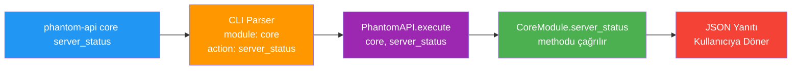
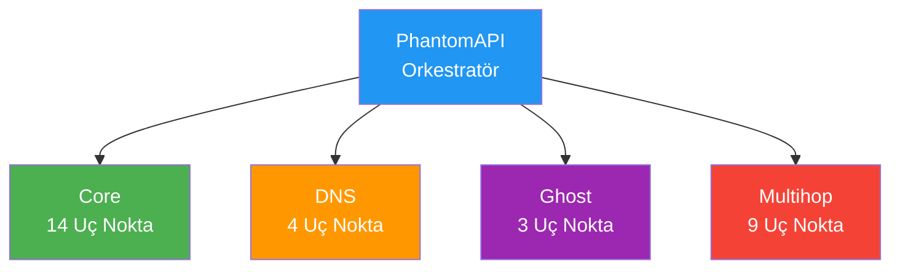
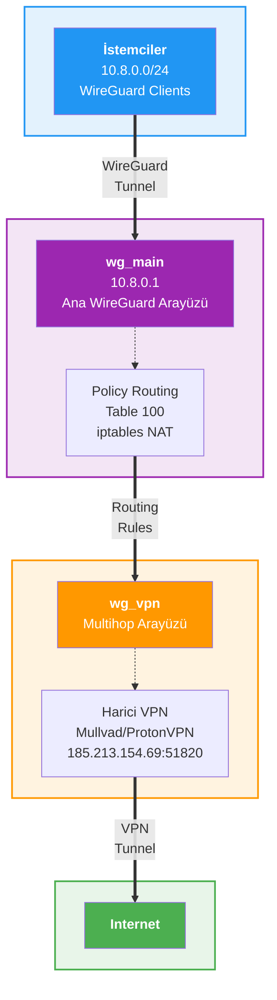
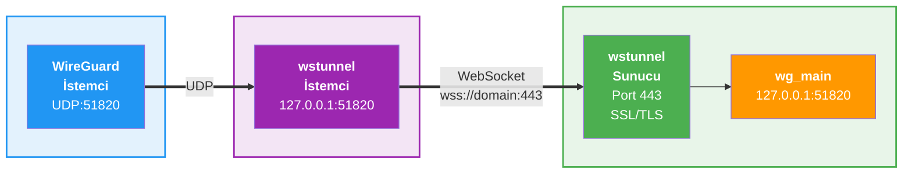

# Phantom-WireGuard Modülleri 🇹🇷

```bash
██████╗ ██╗  ██╗ █████╗ ███╗   ██╗████████╗ ██████╗ ███╗   ███╗
██╔══██╗██║  ██║██╔══██╗████╗  ██║╚══██╔══╝██╔═══██╗████╗ ████║
██████╔╝███████║███████║██╔██╗ ██║   ██║   ██║   ██║██╔████╔██║
██╔═══╝ ██╔══██║██╔══██║██║╚██╗██║   ██║   ██║   ██║██║╚██╔╝██║
██║     ██║  ██║██║  ██║██║ ╚████║   ██║   ╚██████╔╝██║ ╚═╝ ██║
╚═╝     ╚═╝  ╚═╝╚═╝  ╚═╝╚═╝  ╚═══╝   ╚═╝    ╚═════╝ ╚═╝     ╚═╝
Copyright (c) 2025 Rıza Emre ARAS <r.emrearas@proton.me>
Licensed under AGPL-3.0 - see LICENSE file for details
Third-party licenses - see THIRD_PARTY_LICENSES file for details
WireGuard® is a registered trademark of Jason A. Donenfeld.
```

## Genel Bakış

Phantom-WireGuard modül sistemi, her modülün standartlaştırılmış bir API arayüzü üzerinden özelleşmiş işlevsellik
sağladığı bir mimari uygular. 
Tüm modüller `BaseModule`'den türetilir ve yeteneklerini tanımlanmış eylem uç noktaları (**endpoint**) aracılığıyla
sunar.

### Zanaat Atölyesi Metaforu

Bu metafor, karmaşık teknik yapıyı günlük hayattan tanıdık kavramlarla açıklayarak sistemin nasıl çalıştığını daha
kolay anlamamızı sağlar. 
Tıpkı geleneksel bir zanaat atölyesinde ustalar, kalfalar ve çırakların uyumlu çalışması gibi, Phantom-WireGuard'da da
her bileşen kendi uzmanlık alanında görev yapar ve gerektiğinde diğerleriyle koordineli hareket eder. 
Bu benzetme sayesinde, modüllerin bağımsızlığını ve aynı zamanda birbirleriyle olan etkileşimlerini daha net
kavrayabiliriz.

Phantom-WireGuard'ı bir **zanaat atölyesi** olarak düşünebiliriz:

- **Modüller = Usta Zanaatkarlar:** Her modül kendi alanında uzmanlaşmış ustaları temsil etmektedir.

  - **Core:** Ana usta - VPN bağlantılarını kuran ve yöneten baş zanaatkar
  - **DNS:** Yol gösterici - İstemcilere doğru adresleri gösteren kılavuz
  - **Ghost:** Gizli usta - Görünmez hale getirme sanatında uzman
  - **Multihop:** Rota planlayıcı - Karmaşık yol haritaları çizen ve bu yol üzerinden trafiği güvenli bir şekilde
    aktaran stratejist

- **Manager'lar = Çıraklar ve Kalfalar:** Her ustanın yanında çalışan yardımcıları
  - Core'un 7 kalfası (DataStore, KeyGenerator, ClientHandler, ServiceMonitor, ConfigKeeper, NetworkAdmin,
    CommonTools) her biri kendi işinde uzman
  - Ghost'un yardımcıları (StateManager, SSLUtils, WSTunnelUtils, FirewallUtils, NetworkUtils, DNSUtils) ustanın
    işini kolaylaştırır
  - Multihop'un uzmanları (ConfigHandler, NetworkAdmin, RoutingManager, ServiceManager, StateManager,
    ConnectionTester, SessionLogger) koordineli çalışarak karmaşık rotaları yönetir ve trafiği güvenli bir şekilde
    aktarır.

- **Method'lar = Zanaat Aletleri:** Her ustanın kullandığı özel aletler
  - `add_client`: Yeni bağlantı oluşturma kalemi
  - `change_dns_servers`: Adres değiştirme pusulası
  - `enable_ghost`: Görünmezlik pelerini
  - `import_vpn_config`: Harici rota haritası aktarma aracı

- **phantom.json = Ana Defter:** Atölyenin tüm ayarlarının yazılı olduğu ana kayıt defteri

- **TinyDB = Müşteri Defteri:** Tüm istemci bilgilerinin saklandığı müşterilere ait bilgileri içeren özel defter

- **PhantomAPI = Atölye Müdürü:** Gelen işleri doğru ustalara yönlendiren koordinatör

### Örnek İstek Akışı

#### Adım Adım İşleyiş

1. **Kullanıcı Erişimi:** Sistem yöneticisi SSH ile Phantom-WireGuard kurulu sunucuya bağlanır.
   
2. **Komut Girişi:** Terminal'de `phantom-api core server_status` komutunu çalıştırır.
   
3. **CLI Ayrıştırma:** `phantom-api` CLI aracı komutu analiz eder:
   - Modül: `core`
   - Eylem: `server_status`
   - Parametreler: (bu örnekte yok)
   
4. **API Yönlendirme:** CLI, isteği PhantomAPI orkestratörüne iletir.
   
5. **Modül Çağrısı:** PhantomAPI, CoreModule sınıfının `server_status()` metodunu çağırır.
   
6. **Veri Toplama:** Core modülü sistem bilgilerini toplar:
   - WireGuard servis durumu kontrol edilir.
   - Arayüz istatistikleri okunur.
   - İstemci bağlantıları analiz edilir.
   - Yapılandırma bilgileri derlenir.
   
7. **Yanıt Oluşturma:** Toplanan veriler JSON formatında yapılandırılır.
   
8. **Sonuç Görüntüleme:** CLI, JSON yanıtını kullanıcı dostu formatta terminalde gösterir.




## Mimari



## Modül Envanteri

### 1. Core Modülü (`core/`)

**Amaç:** Birincil WireGuard VPN yönetimi ve orkestrasyonu

**Mimari:** 7 adet kendi işlevinde özelleşmiş ve uzmanlaşmış bileşen kütüphanesiyle beraber kendisine özgü
`Manager Pattern` yapısı sayesinde, her bileşen belirli bir sorumluluğu tam kapsamlı olarak üstlenir ve diğer
bileşenlerle koordineli çalışır.

- **DataStore:** TinyDB üzerinde istemci verilerini kalıcı olarak saklar, IP tahsisi ve subnet haritalama işlemlerini
  yönetir, veritabanı bütünlüğünü korur.
- **KeyGenerator:** WireGuard için gerekli tüm kriptografik anahtarları (private, public, preshared) güvenli olarak
  üretir ve format doğrulaması yapar.
- **CommonTools:** İstemci adı validasyonu, IP adres doğrulaması, sistem komut çalıştırıcısı ve genel yardımcı
  fonksiyonları sağlar.
- **ClientHandler:** İstemcilerin tam yaşam döngüsünü (ekleme, kaldırma, listeleme, dışa aktarma) yönetir, peer
  yapılandırmalarını dinamik olarak günceller. *(ConfigGenerationService yardımcı servisi ile istemci
  yapılandırmalarını dinamik olarak üretir)*
- **ServiceMonitor:** WireGuard ve systemd servislerinin sağlık durumunu izler, servis loglarını toplar, yeniden
  başlatma işlemlerini güvenli şekilde yönetir.
- **ConfigKeeper:** phantom.json yapılandırma dosyasını yönetir, gelişmiş ince ayarları (tweak settings) günceller,
  runtime değişikliklerini kalıcı hale getirir.
- **NetworkAdmin:** Subnet değişikliklerini orkestre eder, IP yeniden haritalama yapar, ağ yapılandırmasını güvenli
  şekilde migre eder.

**API Uç Noktaları (toplam 14):**
```
İstemci Yönetimi:
├── add_client              - Yeni WireGuard istemcisi oluştur
├── remove_client           - Mevcut istemciyi sil
├── list_clients            - Sayfalama yapısına uygun istemci listesi
├── export_client           - İstemci yapılandırmasını dışa aktar
└── latest_clients          - Son eklenen istemcileri göster

Servis Yönetimi:
├── server_status           - Kapsamlı sunucu durumu
├── service_logs            - WireGuard servis logu 
├── restart_service         - Wireguard servis yeniden başlatma işlemi
└── get_firewall_status     - Firewall ve NAT durumu

Yapılandırma:
├── get_tweak_settings      - Gelişmiş ince ayarları görüntüle
└── update_tweak_setting    - Gelişmiş ince ayarları değiştir

Ağ Yönetimi:
├── get_subnet_info         - Mevcut subnet bilgisi
├── validate_subnet_change  - Subnet değişiklikleri için ön doğrulama
└── change_subnet           - Subnet geçişini gerçekleştir
```

#### Veri Modelleri

##### `WireGuardClient`
**Dosya:** `phantom/modules/core/models/client_models.py`

İstemci bilgileri ve istemciye özgü kriptografik anahtarlar

```python
@dataclass
class WireGuardClient:
    name: str
    ip: str
    private_key: str
    public_key: str
    preshared_key: str
    created: datetime
    enabled: bool
```

```json
{
  "name": "john-laptop",
  "ip": "10.8.0.2",
  "private_key": "aBcD1234...",
  "public_key": "xYz5678...",
  "preshared_key": "PreShared123...",
  "created": "2025-01-30T10:15:00",
  "enabled": true
}
```

##### `ClientAddResult`
**Dosya:** `phantom/modules/core/models/client_models.py`

İstemci ekleme sonucu

```python
@dataclass
class ClientAddResult:
    client: WireGuardClient
    message: str
```

```json
{
  "client": {
    "name": "john-laptop",
    "ip": "10.8.0.2",
    "public_key": "xYz5678...",
    "created": "2025-01-30T10:15:00",
    "enabled": true
  },
  "message": "Client 'john-laptop' added successfully"
}
```

##### `ClientInfo`
**Dosya:** `phantom/modules/core/models/client_models.py`

İstemci listesi bilgileri

```python
@dataclass
class ClientInfo:
    name: str
    ip: str
    enabled: bool
    created: str
    connected: bool
    connection: Optional[Dict[str, Any]] = None
```

```json
{
  "name": "john-laptop",
  "ip": "10.8.0.2",
  "enabled": true,
  "created": "2025-01-30T10:15:00",
  "connected": true,
  "connection": {
    "latest_handshake": "1 minute ago",
    "transfer_rx": "1.2 GB",
    "transfer_tx": "450 MB"
  }
}
```

##### `ServiceStatus`
**Dosya:** `phantom/modules/core/models/service_models.py`

Servis durumu

```python
@dataclass
class ServiceStatus:
    running: bool
    service_name: str
    started_at: Optional[str] = None
    pid: Optional[str] = None
```

```json
{
  "running": true,
  "service_name": "wg-quick@wg_main",
  "started_at": "2025-01-27 10:15:00",
  "pid": "1234"
}
```

##### `ClientStatistics`
**Dosya:** `phantom/modules/core/models/service_models.py`

İstemci istatistikleri

```python
@dataclass
class ClientStatistics:
    total_configured: int
    enabled_clients: int
    disabled_clients: int
    active_connections: int
```

```json
{
  "total_configured": 10,
  "enabled_clients": 8,
  "disabled_clients": 2,
  "active_connections": 5
}
```

##### `ServerConfig`
**Dosya:** `phantom/modules/core/models/service_models.py`

Sunucu yapılandırması

```python
@dataclass
class ServerConfig:
    interface: str
    config_file: str
    port: int
    network: str
    dns: List[str]
    config_exists: bool
```

```json
{
  "interface": "wg_main",
  "config_file": "/etc/wireguard/wg_main.conf",
  "port": 51820,
  "network": "10.8.0.0/24",
  "dns": ["8.8.8.8", "1.1.1.1"],
  "config_exists": true
}
```

##### `InterfaceStatistics`
**Dosya:** `phantom/modules/core/models/service_models.py`

WireGuard arayüz istatistikleri

```python
@dataclass
class InterfaceStatistics:
    active: bool
    interface: str
    peers: List[Dict[str, Any]]
    public_key: Optional[str] = None
    port: Optional[int] = None
    rx_bytes: Optional[int] = None
    tx_bytes: Optional[int] = None
```

```json
{
  "active": true,
  "interface": "wg_main",
  "public_key": "server_public_key_here",
  "port": 51820,
  "rx_bytes": 1234567890,
  "tx_bytes": 987654321,
  "peers": [
    {
      "name": "john-laptop",
      "public_key": "xYz5678...",
      "allowed_ips": "10.8.0.2/32",
      "latest_handshake": "1 minute ago",
      "rx_bytes": 1234567,
      "tx_bytes": 7654321
    }
  ]
}
```

##### `FirewallConfiguration`
**Dosya:** `phantom/modules/core/models/service_models.py`

Firewall durumu

```python
@dataclass
class FirewallConfiguration:
    ufw: Dict[str, Any]
    iptables: Dict[str, Any]
    nat: Dict[str, Any]
    ports: Dict[str, Any]
    status: str
```

```json
{
  "status": "active",
  "ufw": {
    "status": "active",
    "port_51820": "allowed"
  },
  "iptables": {
    "forward_policy": "ACCEPT",
    "nat_rules": 3
  },
  "nat": {
    "masquerade": "enabled",
    "interface": "eth0"
  },
  "ports": {
    "51820/udp": "open",
    "22/tcp": "open"
  }
}
```

#### Durum Yönetimi

##### Veritabanı
**Konum:** `/opt/phantom-wireguard/data/clients.db` (TinyDB JSON formatı)

**clients tablosu örneği:**
```json
{
  "_default": {
    "1": {
      "name": "john-laptop",
      "ip": "10.8.0.2",
      "private_key": "aBcD1234...",
      "public_key": "xYz5678...",
      "preshared_key": "PreShared123...",
      "created": "2025-01-30T10:15:00",
      "enabled": true
    },
    "2": {
      "name": "alice-phone",
      "ip": "10.8.0.3",
      "private_key": "eFgH5678...",
      "public_key": "MnO9012...",
      "preshared_key": "PreShared456...",
      "created": "2025-01-30T11:30:00",
      "enabled": true
    }
  }
}
```

**ip_assignments tablosu örneği:**
```json
{
  "_default": {
    "1": {
      "ip": "10.8.0.2",
      "client_name": "john-laptop",
      "assigned_at": "2025-01-30T10:15:00"
    },
    "2": {
      "ip": "10.8.0.3",
      "client_name": "alice-phone",
      "assigned_at": "2025-01-30T11:30:00"
    }
  }
}
```

##### Yapılandırma Dosyası
**Konum:** `/opt/phantom-wireguard/config/phantom.json`

**Örnek phantom.json içeriği:**
```json
{
  "version": "core-v1",
  "wireguard": {
    "interface": "wg_main",
    "port": 51820,
    "network": "10.8.0.0/24"
  },
  "server": {
    "ip": "203.0.113.1",
    "private_key": "aBcDeFgHiJkLmNoPqRsTuVwXyZ1234567890ABCDEF=",
    "public_key": "XyZ9876543210aBcDeFgHiJkLmNoPqRsTuVwXyZABC="
  },
  "tweaks": {
    "restart_service_after_client_creation": false
  },
  "dns": {
    "primary": "8.8.8.8",
    "secondary": "8.8.4.4"
  },
  "multihop": {
    "enabled": false,
    "active_exit": null,
    "vpn_interface_name": "wg_vpn",
    "updated_at": "2025-01-30T10:15:00.000000"
  }
}
```

##### İstemci Yapılandırmaları  
**Dinamik Üretim:** İstemci yapılandırmaları dosya sisteminde saklanmaz, `export_client` API çağrısı ile dinamik
olarak üretilir.

**ConfigGenerationService tarafından üretilen örnek yapılandırma:**
```ini
[Interface]
PrivateKey = aBcD1234...
Address = 10.8.0.2/24
DNS = 1.1.1.1, 1.0.0.1
MTU = 1420

[Peer]
PublicKey = [server-public-key]
PresharedKey = PreShared123...
Endpoint = 203.0.113.1:51820
AllowedIPs = 0.0.0.0/0, 10.8.0.0/24
PersistentKeepalive = 25
```

**Not:** İstemci bilgileri TinyDB'de saklanır, sunucu ayarları phantom.json'dan alınır ve yapılandırma bellekte
oluşturulur. 
PhantomAPI kullanan CLI aracı bu yapılandırmadan QR kod üretmektedir.

##### WireGuard Sunucu Yapılandırması
**Konum:** `/etc/wireguard/wg_main.conf`

**Örnek sunucu config dosyası:**
```ini
[Interface]
PrivateKey = [server-private-key]
Address = 10.8.0.1/24
ListenPort = 51820
PostUp = iptables -A FORWARD -i %i -j ACCEPT; iptables -t nat -A POSTROUTING -o eth0 -j MASQUERADE
PostDown = iptables -D FORWARD -i %i -j ACCEPT; iptables -t nat -D POSTROUTING -o eth0 -j MASQUERADE

# Client: john-laptop
[Peer]
PublicKey = xYz5678...
PresharedKey = PreShared123...
AllowedIPs = 10.8.0.2/32

# Client: alice-phone
[Peer]
PublicKey = MnO9012...
PresharedKey = PreShared456...
AllowedIPs = 10.8.0.3/32
```

---

### 2. DNS Modülü (`dns/`)
**Amaç:** Tüm WireGuard istemcileri için merkezi DNS sunucu yapılandırma yönetimi

**Mimari:** Tek modül yapısı, manager pattern kullanmaz. Doğrudan phantom.json ile çalışır.

**Not:** DNS modülü bağımsız bir modül olarak çalışır. Core modülündeki `ConfigGenerationService` yardımcı servisi,
istemci yapılandırması oluştururken DNS bilgilerini phantom.json dosyasından okur. Bu sayede DNS değişiklikleri tüm
yeni istemci yapılandırmalarına otomatik olarak yansıtılır.

**API Uç Noktaları (toplam 4):**
```
├── change_dns_servers  - DNS sunucularını sistem genelinde güncelle
├── test_dns_servers    - DNS sunucu bağlantısını ve performansını test et
├── status              - Tam DNS durumu ve sağlık kontrolü
└── get_dns_servers     - Mevcut DNS yapılandırmasını al
```

**Ana Özellikler:**
- IP format doğrulaması (NetworkValidator)
- DNS sunucu erişilebilirlik testleri (nslookup/dig)
- Sağlık durumu değerlendirmesi (healthy/degraded)
- Typed model desteği (BaseModel inheritance)

**Test Yetenekleri:**
- `nslookup` ile DNS çözümleme testi
- `dig` ile hızlı sorgu performansı
- Özel domain parametresi desteği
- Birden fazla DNS sunucu testi

#### Veri Modelleri

##### `DNSServerConfig`
**Dosya:** `phantom/modules/dns/models/dns_models.py`

DNS sunucu yapılandırması ve önceki değerler

```python
@dataclass
class DNSServerConfig:
    primary: str
    secondary: str
    previous_primary: Optional[str] = None
    previous_secondary: Optional[str] = None
```

```json
{
  "primary": "1.1.1.1",
  "secondary": "1.0.0.1",
  "previous_primary": "8.8.8.8",
  "previous_secondary": "8.8.4.4"
}
```

##### `ChangeDNSResult`
**Dosya:** `phantom/modules/dns/models/dns_models.py`

DNS değişiklik işlemi sonucu

```python
@dataclass
class ChangeDNSResult:
    success: bool
    dns_servers: DNSServerConfig
    client_configs_updated: ClientConfigUpdateResult
```

```json
{
  "success": true,
  "dns_servers": {
    "primary": "1.1.1.1",
    "secondary": "1.0.0.1",
    "previous_primary": "8.8.8.8",
    "previous_secondary": "8.8.4.4"
  },
  "client_configs_updated": {
    "success": true,
    "message": "All client configurations updated successfully"
  }
}
```

##### `DNSTestServerResult`
**Dosya:** `phantom/modules/dns/models/dns_models.py`

Tek bir DNS sunucu test sonucu

```python
@dataclass
class DNSTestServerResult:
    server: str
    success: bool
    status: str
    response_time_ms: Optional[float] = None
    test_domain: Optional[str] = None
    error: Optional[str] = None
```

```json
{
  "server": "1.1.1.1",
  "success": true,
  "status": "OK",
  "response_time_ms": 23.5,
  "test_domain": "google.com",
  "error": null
}
```

##### `TestDNSResult`
**Dosya:** `phantom/modules/dns/models/dns_models.py`

Tüm DNS test sonuçları

```python
@dataclass
class TestDNSResult:
    all_passed: bool
    servers_tested: int
    results: List[DNSTestServerResult]
```

```json
{
  "all_passed": true,
  "servers_tested": 2,
  "results": [
    {
      "server": "1.1.1.1",
      "success": true,
      "status": "OK",
      "response_time_ms": 23.5,
      "test_domain": "google.com"
    },
    {
      "server": "1.0.0.1",
      "success": true,
      "status": "OK",
      "response_time_ms": 18.2,
      "test_domain": "google.com"
    }
  ]
}
```

##### `DNSStatusResult`
**Dosya:** `phantom/modules/dns/models/dns_models.py`

Kapsamlı DNS durum bilgisi

```python
@dataclass
class DNSStatusResult:
    mode: str
    configuration: DNSConfiguration
    health: DNSHealth
```

```json
{
  "mode": "standard",
  "configuration": {
    "primary": "1.1.1.1",
    "secondary": "1.0.0.1"
  },
  "health": {
    "status": "healthy",
    "test_results": [
      {
        "server": "1.1.1.1",
        "tests": [
          {
            "domain": "google.com",
            "success": true,
            "response": "142.250.185.206"
          },
          {
            "domain": "cloudflare.com",
            "success": true,
            "response": "104.16.132.229"
          }
        ]
      },
      {
        "server": "1.0.0.1",
        "tests": [
          {
            "domain": "google.com",
            "success": true,
            "response": "142.250.185.206"
          },
          {
            "domain": "cloudflare.com",
            "success": true,
            "response": "104.16.132.229"
          }
        ]
      }
    ]
  }
}
```

##### `GetDNSServersResult`
**Dosya:** `phantom/modules/dns/models/dns_models.py`

Aktif DNS sunucu bilgileri

```python
@dataclass
class GetDNSServersResult:
    primary: str
    secondary: str
```

```json
{
  "primary": "8.8.8.8",
  "secondary": "8.8.4.4"
}
```

**Yapılandırma Depolama:**
```json
{
  "dns": {
    "primary": "8.8.8.8",
    "secondary": "8.8.4.4"
  }
}
```

**Not:** DNS değişiklikleri anında phantom.json dosyasına kaydedilir ve tüm yeni istemci yapılandırmaları bu
ayarları kullanır.

---
### 3. Multihop Modülü (`multihop/`)

**Amaç:** Harici VPN sağlayıcıları üzerinden çok katmanlı yönlendirme ve gelişmiş gizlilik

**Mimari:** 7 adet özelleşmiş bileşen sınıfı ve 1 yardımcı modül ile orkestrasyon sistemi. Her bileşen spesifik bir
sorumluluk alanına sahiptir ve koordineli çalışır.

- **ConfigHandler:** VPN yapılandırma dosyalarını içe aktarır, doğrular ve optimize eder. WireGuard formatındaki
  yapılandırmaları ayrıştırır.
- **NetworkAdmin:** wg_vpn (multihop) arayüzünü yönetir, IP adres ataması yapar, systemd-networkd yapılandırmalarını
  düzenler.
- **RoutingManager:** İlke tabanlı yönlendirme kurallarını (PBR) ve iptables NAT kurallarını yönetir. Tablo 100
  üzerinden trafik yönlendirmesi yapar.
- **ServiceManager:** phantom-multihop-monitor systemd servisini kontrol eder, servis durumunu izler.
- **StateManager:** Multihop durumunu phantom.json içinde kalıcı hale getirir, yapılandırma tutarlılığını
  sağlar.
- **ConnectionTester:** VPN bağlantılarını test eder, handshake durumunu kontrol eder, dış IP adresini doğrular.
- **SessionLogger:** Tüm multihop işlemlerini günlükler, oturum bazlı izleme sağlar.
- **common_tools:** (Modül) Sabitler, yardımcı fonksiyonlar ve paylaşılan değişkenler içerir. DEFAULT_VPN_DNS,
  MULTIHOP_TABLE_ID gibi sabitler burada tanımlıdır.

**API Uç Noktaları (toplam 9):**
```
Yapılandırma Yönetimi:
├── import_vpn_config   - Harici VPN yapılandırmasını içe aktar
├── remove_vpn_config   - İçe aktarılan yapılandırmayı sil
├── list_exits          - Mevcut VPN çıkış noktalarını listele

Yönlendirme Kontrolü:
├── enable_multihop     - Multihop yönlendirmeyi etkinleştir
├── disable_multihop    - Multihop yönlendirmeyi devre dışı bırak
└── reset_state         - Tüm multihop durumunu sıfırla

Durum ve Test:
├── status              - Multihop durumu
├── test_vpn            - VPN bağlantısını test et
└── get_session_log     - Oturum günlüklerini görüntüle
```

#### Veri Modelleri

##### `VPNExitInfo`
**Dosya:** `phantom/modules/multihop/models/multihop_models.py`

Çıkış noktası bilgileri

```python
@dataclass
class VPNExitInfo:
    name: str
    endpoint: str
    active: bool
    provider: str
    imported_at: Optional[str] = None
    multihop_enhanced: bool = False
```

```json
{
  "name": "mullvad-se-sto",
  "endpoint": "185.213.154.69:51820",
  "active": true,
  "provider": "Mullvad",
  "imported_at": "2025-01-30T15:30:00",
  "multihop_enhanced": true
}
```

##### `ImportResult`
**Dosya:** `phantom/modules/multihop/models/multihop_models.py`

VPN yapılandırma içe aktarma sonucu

```python
@dataclass
class ImportResult:
    success: bool
    exit_name: str
    message: str
    optimizations: Optional[List[str]] = None
```

```json
{
  "success": true,
  "exit_name": "mullvad-se-sto",
  "message": "VPN config 'mullvad-se-sto' imported successfully",
  "optimizations": [
    "MTU optimized to 1420",
    "PersistentKeepalive set to 25"
  ]
}
```

##### `EnableMultihopResult`
**Dosya:** `phantom/modules/multihop/models/multihop_models.py`

Multihop etkinleştirme sonucu

```python
@dataclass
class EnableMultihopResult:
    exit_name: str
    multihop_enabled: bool
    handshake_established: bool
    connection_verified: bool
    monitor_started: bool
    traffic_flow: str
    peer_access: str
    message: str
```

```json
{
  "exit_name": "mullvad-se-sto",
  "multihop_enabled": true,
  "handshake_established": true,
  "connection_verified": true,
  "monitor_started": true,
  "traffic_flow": "Clients -> Phantom -> Mullvad -> Internet",
  "peer_access": "Clients can access each other",
  "message": "Multihop enabled successfully"
}
```

##### `VPNTestResult`
**Dosya:** `phantom/modules/multihop/models/multihop_models.py`

VPN bağlantı test sonucu

```python
@dataclass
class VPNTestResult:
    exit_name: str
    endpoint: str
    tests: Dict[str, TestResult]
    all_tests_passed: bool
    message: str
```

```json
{
  "exit_name": "mullvad-se-sto",
  "endpoint": "185.213.154.69:51820",
  "tests": {
    "handshake": {
      "passed": true,
      "has_recent_handshake": true
    },
    "external_ip": {
      "passed": true,
      "vpn_ip": "185.213.154.69",
      "host": "se-sto-wg-001.mullvad.net"
    }
  },
  "all_tests_passed": true,
  "message": "All tests passed"
}
```

##### `ListExitsResult`
**Dosya:** `phantom/modules/multihop/models/multihop_models.py`

Çıkış noktaları listesi

```python
@dataclass
class ListExitsResult:
    exits: List[VPNExitInfo]
    multihop_enabled: bool
    active_exit: Optional[str]
    total: int
```

```json
{
  "exits": [
    {
      "name": "mullvad-se-sto",
      "endpoint": "185.213.154.69:51820",
      "active": true,
      "provider": "Mullvad",
      "imported_at": "2025-01-30T15:30:00",
      "multihop_enhanced": true
    },
    {
      "name": "proton-ch-zur",
      "endpoint": "146.70.86.2:51820",
      "active": false,
      "provider": "ProtonVPN",
      "imported_at": "2025-01-30T16:00:00",
      "multihop_enhanced": false
    }
  ],
  "multihop_enabled": true,
  "active_exit": "mullvad-se-sto",
  "total": 2
}
```

##### `MultihopStatusResult`
**Dosya:** `phantom/modules/multihop/models/multihop_models.py`

Detaylı multihop durumu

```python
@dataclass
class MultihopStatusResult:
    enabled: bool
    active_exit: Optional[str]
    available_configs: int
    vpn_interface: Dict[str, Any]
    monitor_status: Dict[str, Any]
    traffic_routing: str
    traffic_flow: str
```

```json
{
  "enabled": true,
  "active_exit": "mullvad-se-sto",
  "available_configs": 2,
  "vpn_interface": {
    "name": "wg_vpn",
    "status": "up",
    "peers": 1,
    "rx_bytes": 1234567890,
    "tx_bytes": 987654321
  },
  "monitor_status": {
    "service": "phantom-multihop-monitor",
    "running": true,
    "since": "2025-01-30T15:30:00"
  },
  "traffic_routing": "Policy-based (Table 100)",
  "traffic_flow": "10.8.0.0/24 -> wg_main -> wg_vpn -> Exit"
}
```

##### `DeactivationResult`
**Dosya:** `phantom/modules/multihop/models/multihop_models.py`

Multihop devre dışı bırakma sonucu

```python
@dataclass
class DeactivationResult:
    multihop_enabled: bool
    previous_exit: Optional[str]
    interface_cleaned: bool
    message: str
```

```json
{
  "multihop_enabled": false,
  "previous_exit": "mullvad-se-sto",
  "interface_cleaned": true,
  "message": "Multihop disabled successfully"
}
```

##### `RemoveConfigResult`
**Dosya:** `phantom/modules/multihop/models/multihop_models.py`

VPN yapılandırma silme sonucu

```python
@dataclass
class RemoveConfigResult:
    removed: str
    was_active: bool
    message: str
```

```json
{
  "removed": "mullvad-se-sto",
  "was_active": true,
  "message": "VPN config 'mullvad-se-sto' removed successfully"
}
```

##### `ResetStateResult`
**Dosya:** `phantom/modules/multihop/models/multihop_models.py`

Durum sıfırlama sonucu

```python
@dataclass
class ResetStateResult:
    reset_complete: bool
    cleanup_successful: bool
    cleaned_up: List[str]
    message: str
```

```json
{
  "reset_complete": true,
  "cleanup_successful": true,
  "cleaned_up": [
    "wg_vpn interface",
    "routing rules",
    "2 VPN configs"
  ],
  "message": "Multihop state reset successfully"
}
```

#### Durum Yönetimi

##### Yapılandırma Dosyası
**phantom.json içinde multihop bölümü:**
```json
{
  "multihop": {
    "enabled": true,
    "active_exit": "mullvad-se-sto",
    "vpn_interface_name": "wg_vpn",
    "updated_at": "2025-01-30T15:30:00.000000"
  }
}
```

##### VPN Yapılandırmaları
**Konum:** `/opt/phantom-wireguard/config/vpn_configs/`

İçe aktarılan her VPN yapılandırması bu dizinde saklanır:
- `mullvad-se-sto.conf`
- `proton-ch-zur.conf`

##### Yönlendirme Mimarisi



**Routing Kuralları:**
- Tablo 100: Multihop yönlendirme tablosu
- ip rule: 10.8.0.0/24'ten gelen trafik için Table 100 kullan
- iptables: MASQUERADE ve FORWARD kuralları

##### Sistem Servisleri

**phantom-multihop-monitor.service:**
- VPN bağlantısını sürekli izler
- Bağlantı koptuğunda otomatik yeniden bağlanma
- Her 30 saniyede bir sağlık kontrolü

**phantom-multihop-interface.service:**
- Sistem yeniden başlatıldığında wg_vpn arayüzünü geri yükler
- Routing kurallarını yeniden uygular
- phantom.json'daki multihop state'ini okuyarak çalışır

---

### 4. Ghost Modülü (`ghost/`)

**Amaç:** WebSocket tünelleme ile sansüre dayanıklı ve gizlenmiş VPN bağlantıları

**Mimari:** 6 adet fonksiyonel yardımcı modül ile wstunnel tabanlı WebSocket tünelleme sistemi. Her modül spesifik
görevler için fonksiyon kümeleri içerir.

- **state_manager:** Ghost modu durumunu `/opt/phantom-wireguard/config/ghost-state.json` dosyasında yönetir,
  init/save/rollback işlemleri yapar.
- **ssl_utils:** Let's Encrypt ile SSL sertifikası alır (certbot standalone), port 80'i geçici açar/kapatır,
  sertifika temizliği yapar.
- **wstunnel_utils:** wstunnel binary'sini indirir/kurar, systemd servisi oluşturur, token üretir, process yönetimi
  sağlar.
- **firewall_utils:** UFW kurallarını yönetir (443, 80 portları), güvenlik duvarı durumunu kontrol eder, kuralları
  temizler.
- **network_utils:** Sunucu IP adresini alır, bağlantı komutunu oluşturur, ağ arayüzlerini tespit eder.
- **dns_utils:** Domain A kaydını doğrular, DNS çözümleme yapar, sunucu IP'si ile karşılaştırır.

**API Uç Noktaları (toplam 3):**
```
├── enable   - Domain ile Ghost modunu etkinleştir
├── disable  - Ghost modunu devre dışı bırak
└── status   - Ghost modu operasyonel durumu
```

**Ana Özellikler:**
- WebSocket üzerinden tünel (wstunnel)
- SSL/TLS şifreleme (Let's Encrypt sertifikası)
- Token tabanlı güvenlik (secret/prefix)
- Port 443'te doğrudan dinleme
- Sadece localhost:51820'ye yönlendirme

#### Veri Modelleri

##### `EnableGhostResult`
**Dosya:** `phantom/modules/ghost/models/ghost_models.py`

Ghost modu etkinleştirme sonucu

```python
@dataclass
class EnableGhostResult:
    status: str
    server_ip: str
    domain: str
    secret: str
    protocol: str
    port: int
    activated_at: str
    connection_command: str
```

```json
{
  "status": "active",
  "server_ip": "203.0.113.1",
  "domain": "vpn.example.com",
  "secret": "Xy9k2mN3pQ5rT7vW",
  "protocol": "wss",
  "port": 443,
  "activated_at": "2025-01-30T18:45:00",
  "connection_command": "wstunnel client --remote wss://vpn.example.com:443 --token Xy9k2mN3pQ5rT7vW --local 127.0.0.1:51820"
}
```

##### `DisableGhostResult`
**Dosya:** `phantom/modules/ghost/models/ghost_models.py`

Ghost modu devre dışı bırakma sonucu

```python
@dataclass
class DisableGhostResult:
    status: str
    message: str
    restored: Optional[bool] = None
```

```json
{
  "status": "disabled",
  "message": "Ghost mode disabled successfully",
  "restored": true
}
```

##### `GhostStatusResult`
**Dosya:** `phantom/modules/ghost/models/ghost_models.py`

Ghost modu durum bilgisi

```python
@dataclass
class GhostStatusResult:
    status: str
    enabled: bool
    message: Optional[str] = None
    server_ip: Optional[str] = None
    domain: Optional[str] = None
    secret: Optional[str] = None
    protocol: Optional[str] = None
    port: Optional[int] = None
    services: Optional[GhostServiceInfo] = None
    activated_at: Optional[str] = None
    connection_command: Optional[str] = None
    client_export_info: Optional[str] = None
```

```json
{
  "status": "active",
  "enabled": true,
  "server_ip": "203.0.113.1",
  "domain": "vpn.example.com",
  "secret": "Xy9k2mN3pQ5rT7vW",
  "protocol": "wss",
  "port": 443,
  "services": {
    "wstunnel": "running"
  },
  "activated_at": "2025-01-30T18:45:00",
  "connection_command": "wstunnel client --remote wss://vpn.example.com:443 --token Xy9k2mN3pQ5rT7vW --local 127.0.0.1:51820",
  "client_export_info": "Export clients with: phantom-api core export_client john-laptop"
}
```

##### `GhostServiceInfo`
**Dosya:** `phantom/modules/ghost/models/ghost_models.py`

Ghost servis durumu

```python
@dataclass
class GhostServiceInfo:
    wstunnel: str
```

```json
{
  "wstunnel": "running"
}
```

#### Durum Yönetimi

##### Durum Dosyası
**Konum:** `/opt/phantom-wireguard/config/ghost-state.json`

```json
{
  "enabled": true,
  "server_ip": "203.0.113.1",
  "domain": "vpn.example.com",
  "secret": "Xy9k2mN3pQ5rT7vW",
  "protocol": "wss",
  "port": 443,
  "activated_at": "2025-01-30T18:45:00",
  "connection_command": "wstunnel client --remote wss://vpn.example.com:443 --token Xy9k2mN3pQ5rT7vW --local 127.0.0.1:51820"
}
```

##### wstunnel Servisi
**systemd Servis Dosyası:** `/etc/systemd/system/wstunnel.service`

##### Ghost Mode Akışı



**Akış Açıklaması:**
1. WireGuard istemcisi UDP trafiğini yerel wstunnel istemcisine gönderir (127.0.0.1:51820)
2. wstunnel istemcisi trafiği WebSocket üzerinden TLS ile şifreler (wss protokolü)
3. wstunnel sunucusu 443 portunda SSL sertifikasıyla dinler (Let's Encrypt)
4. wstunnel sunucusu gelen WebSocket trafiğini UDP'ye dönüştürür
5. UDP trafiği WireGuard arayüzüne (127.0.0.1:51820) iletilir

---

*Phantom-WireGuard - Teknik Dokümantasyon*